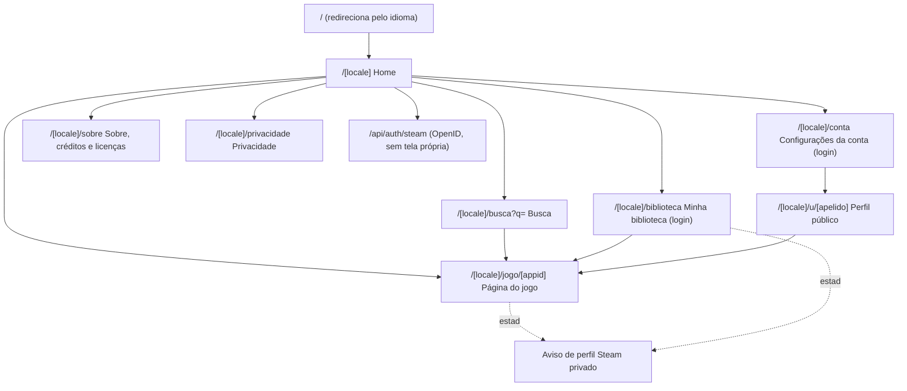
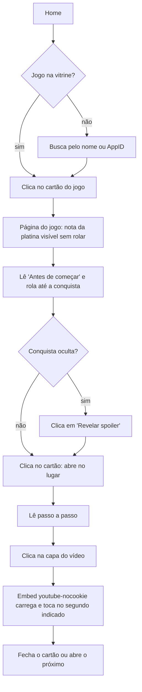
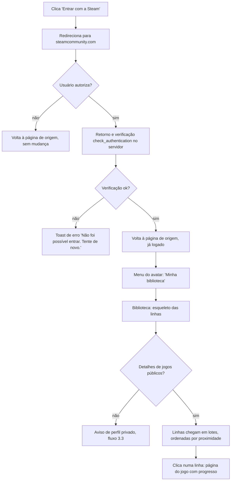
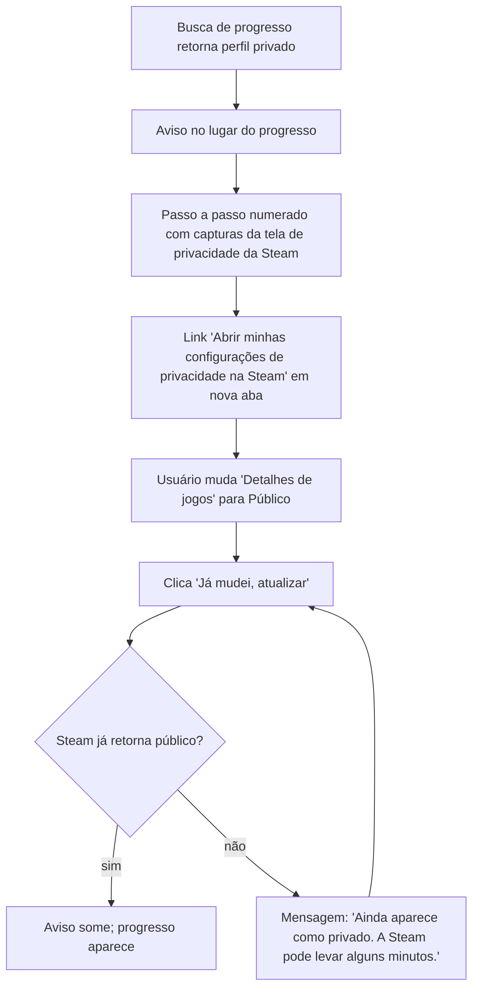
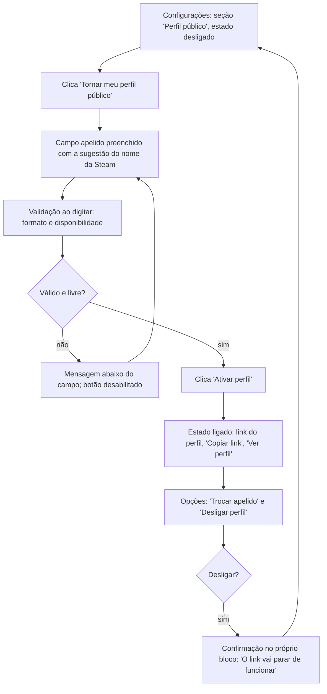

# Completionist: Especificação de UI/UX

Fase 3 do fluxo AIOX `greenfield-fullstack`, a cargo do @ux-design-expert (Uma). Base:
`docs/prd.md` (fonte da verdade, seções 2, 3 e épicos), `docs/project-brief.md` e as
decisões do grill-me em `.claude/memory/estado.md`.

## 1. Introdução

Este documento define os objetivos de experiência, a arquitetura de informação, os fluxos,
os componentes e a identidade visual da interface do Completionist. É a base para o design
visual e para o desenvolvimento do front-end, e serve de referência para o @architect e o @dev.

Nada aqui cria funcionalidade nova. Cada detalhe de interface aponta para um requisito do
PRD (FR, NFR ou story). Onde o PRD deixa uma escolha em aberto, a decisão está marcada como
**Decisão de UX** com uma justificativa curta.

### 1.1 Personas

- **Caçador focado (principal):** joga no PC, quer platinar um jogo popular e travou em
  algumas conquistas. Abre o site numa segunda tela ou no celular ao lado do monitor. Quer
  saber em segundos se vale a pena e o que fazer agora.
- **Completista de biblioteca:** entra com a Steam, tem vários jogos quase completos e quer
  ver só o que falta, escolhendo onde investir o tempo (FR21).
- **Visitante de portfólio:** recrutador ou curioso vindo do portfólio do Lucas. Não faz
  login. Precisa ver conteúdo real funcionando na primeira página que abre (brief, seção 4).

### 1.2 Metas de usabilidade

- **Resposta em segundos:** na página de um jogo com guia, a nota da platina (dificuldade,
  horas, jogadas) fica visível sem rolar, em desktop e no celular.
- **Consulta com o jogo aberto:** uma conquista se abre no lugar, com o vídeo já no segundo
  certo, sem trocar de página nem perder a posição na lista.
- **Zero spoiler acidental:** nenhuma conquista oculta aparece revelada sem ação do usuário,
  a não ser que ele já tenha desbloqueado ou tenha ligado o interruptor global (FR5, FR6).
- **Funciona sem login:** todo o conteúdo dos guias e das listas é acessível a visitantes.
- **Erro que se explica:** perfil Steam privado sempre vem com o passo a passo para resolver (FR20).

### 1.3 Princípios de design

1. **A conquista é a protagonista.** Ícone grande, nome legível e raridade visível em cada
   item. O resto da tela serve à lista.
2. **Revelação progressiva.** Cartão fechado mostra o essencial; aberto mostra passo a passo,
   vídeo, fotos e fontes. Spoiler só com clique.
3. **Raridade nunca só por cor.** Toda indicação de raridade tem texto (faixa e %) junto da cor.
4. **Escuro por padrão, sóbrio.** A estética é de caçador de conquista, sem neon nem ruído.
   O tom de platina é o único destaque; as cores de raridade ficam restritas à raridade.
5. **Mesma página, dois idiomas.** Todo layout aguenta textos em PT cerca de 30% mais longos
   que em inglês sem quebrar.

### 1.4 Histórico

| Data | Versão | Descrição | Autor |
|---|---|---|---|
| 2026-09-25 | 1.0 | Primeira versão, a partir do PRD 1.0 | @ux-design-expert |

## 2. Arquitetura de informação

### 2.1 Mapa do site

Todas as rotas vivem sob `/[locale]`, com `locale` em `pt` ou `en` (FR26). A raiz `/`
redireciona pelo idioma do navegador (Story 1.1).



| # | Tela (PRD 3) | Rota | Acesso |
|---|---|---|---|
| 1 | Home | `/[locale]` | público |
| 2 | Busca | `/[locale]/busca?q={termo}` | público |
| 3 | Página do jogo | `/[locale]/jogo/[appid]` | público; mais recursos com login |
| 4 | Minha biblioteca | `/[locale]/biblioteca` | login (sem login, redireciona para a home com a chamada "Entrar com a Steam") |
| 5 | Configurações da conta | `/[locale]/conta` | login |
| 6 | Perfil público | `/[locale]/u/[apelido]` | público; 404 se desligado ou inexistente (FR25) |
| 7 | Aviso de perfil Steam privado | sem rota própria | estado exibido na página do jogo e na biblioteca |
| 8 | Sobre, privacidade, créditos e licenças | `/[locale]/sobre` e `/[locale]/privacidade` | público |

**Decisão de UX (tela 7 sem rota):** o aviso aparece exatamente onde o progresso faltou
(página do jogo ou biblioteca), e o botão "Já mudei, atualizar" recarrega aquele mesmo
contexto. Uma rota separada tiraria o usuário do lugar onde ele estava.

**Decisão de UX (tela 8 em duas rotas):** "Sobre" reúne propósito, fontes, créditos e
licenças (Story 2.4); "Privacidade" fica separada porque é linkada do fluxo de apagar conta
e precisa de URL estável (NFR12, Story 3.1).

**Decisão de UX (slugs):** as rotas usam os segmentos do PRD (`jogo`, `u`, e em português
`busca`, `biblioteca`, `conta`, `sobre`, `privacidade`) nos dois idiomas. A tradução dos
segmentos para `/en` (ex.: `/en/game/`) fica como ponto aberto para o @architect (ver 12.2).

### 2.2 Navegação

**Cabeçalho (todas as telas, fixo no topo):**

- Esquerda: logotipo "Completionist" (link para a home do idioma).
- Centro: campo de busca (Story 1.4). No celular vira um ícone de lupa que abre a busca
  em tela cheia.
- Direita, nesta ordem: interruptor global "Spoilers" (FR6), seletor de idioma PT/EN (FR26),
  e então "Entrar com a Steam" (visitante) ou o avatar com menu (logado).
- Menu do avatar: "Minha biblioteca", "Configurações", "Sair".
- Até o épico 3, o botão "Entrar com a Steam" fica oculto (Story 2.4, item 2).

**Rodapé (todas as telas):** aviso de que o site não tem vínculo com a Valve, "Powered by
Steam" (NFR5), links para Sobre e Privacidade, licenças MIT e CC BY-NC-SA 4.0 (NFR13) e
link do repositório. Nas páginas de jogo com guia, o rodapé cita a licença do guia.

**Navegação secundária:** dentro da página do jogo, a barra de ferramentas da lista
(alternância, filtros) fica fixa ao rolar (PRD 3, interações principais).

**Breadcrumb:** não há. A hierarquia é rasa (home, jogo) e o cabeçalho sempre leva de volta.
Na página do jogo, um link "Voltar" discreto aparece apenas quando o usuário veio da
biblioteca ou da busca, usando o histórico do navegador.

## 3. Fluxos de usuário

### 3.1 Visitante abre um jogo com guia, revela spoiler e assiste ao vídeo

**Objetivo:** chegar ao passo a passo de uma conquista específica, sem login.
**Entradas:** vitrine da home, busca, link compartilhado.
**Sucesso:** o vídeo toca a partir do segundo indicado e o usuário continua na lista.



**Casos de borda:**

- Jogo sem guia: a página mostra o aviso "O guia deste jogo ainda não foi produzido" e a
  lista por % (FR3); o cartão abre apenas com a descrição da Steam e a %, sem vídeo.
- Guia existe só no outro idioma: aviso de guia não produzido neste idioma com link para
  o outro (FR28).
- Conquista sem vídeo nem foto: o cartão aberto mostra só texto e fontes.
- Vídeo removido do YouTube: o embed mostra o erro do próprio YouTube; o botão "Sugerir
  correção" fica logo abaixo.
- Interruptor global de spoilers ligado: nenhuma conquista aparece embaçada, inclusive os
  nomes das etapas do roteiro (FR11).
- AppID inexistente ou jogo sem conquistas: página de erro tratada com a busca (Story 1.2, item 5).

**Notas:** o vídeo usa uma capa estática com botão de play e só carrega o iframe no clique.
Isso mantém a página leve (NFR8) e evita carregar dezenas de embeds.

### 3.2 Entrar com a Steam e abrir "Minha biblioteca"

**Objetivo:** ver os próprios jogos ordenados pela proximidade da platina.
**Entradas:** botão "Entrar com a Steam" no cabeçalho, chamada da home, filtro "o que me
falta" desabilitado na página do jogo.
**Sucesso:** a biblioteca carrega e o primeiro jogo da lista é o mais perto da platina.



**Casos de borda:**

- Biblioteca grande: carregamento progressivo com contador "Carregando 40 de 312 jogos"
  (Story 3.4, item 3). A ordem final se estabiliza quando o lote termina; até lá, as linhas
  novas entram sem empurrar a linha que tem foco.
- Nenhum jogo com conquistas: estado vazio explicando e apontando para a vitrine.
- "Atualizar" clicado antes de 5 minutos: botão desabilitado com "Disponível em 3 min" (NFR3).

**Notas:** após o login, o usuário volta para a página de onde saiu. A biblioteca não é
aberta automaticamente, para não tirar do contexto quem entrou a partir de um jogo.

### 3.3 Perfil Steam privado

**Objetivo:** entender por que o progresso não aparece e resolver.
**Entradas:** página do jogo logado, biblioteca.
**Sucesso:** depois de mudar a privacidade na Steam, o usuário clica "Já mudei, atualizar"
e o progresso aparece.



**Casos de borda:** o limite de 5 minutos (NFR3) não se aplica enquanto o perfil está
privado, porque nenhuma chamada de progresso teve sucesso; se o @architect decidir aplicar,
o botão mostra a contagem. Não existe marcação manual (FR20): o aviso não oferece essa saída.

**Notas:** na página do jogo, o aviso aparece de forma compacta acima da lista (a lista
continua usável como visitante). Na biblioteca, ocupa a área principal, porque sem progresso
não há o que ordenar.

### 3.4 Ativar o perfil público

**Objetivo:** tornar o perfil público com um apelido e compartilhar o link.
**Entradas:** Configurações da conta.
**Sucesso:** o perfil responde em `/[locale]/u/[apelido]` e o link aparece pronto para copiar.



**Casos de borda:**

- Sugestão do nome da Steam com caracteres inválidos: a sugestão chega já normalizada
  (minúsculas, sem espaço nem acento); o formato exato é definido pelo @architect.
- Trocar apelido: aviso de que o link antigo deixa de funcionar (FR25).
- Apagar conta (mesma tela, zona de perigo): confirmação digitando o apelido ou a palavra
  "apagar", com link para a Privacidade (FR22). Confirmações ficam na página, sem `confirm()`.

## 4. Wireframes

**Arquivos de design:** não há ferramenta de design no MVP. Os wireframes abaixo e os tokens
da seção 6 são a referência; o @dev implementa direto em código e o design é revisado no
preview da Vercel.

### 4.1 Página do jogo com guia (desktop, 1280 px)

```
+------------------------------------------------------------------------------------+
| [C] Completionist     [ Buscar jogo ou AppID...        ]   Spoilers [o ]  PT|EN  (A)v |
+------------------------------------------------------------------------------------+
|  +---------------+   Hollow Knight                                  [Guia completo] |
|  |               |   Team Cherry                                                    |
|  |     CAPA      |   +------------+ +-----------+ +-----------+                     |
|  |   460x215     |   | Dificuldade| |  Horas    | |  Jogadas  |                     |
|  |               |   |   7 / 10   | |  ~70 h    | |    2      |                     |
|  +---------------+   +------------+ +-----------+ +-----------+                     |
|                      Seu progresso  41/63  [##########........]  Atualizar          |
|                      Base 38/52 [#########...]  Total 41/63       Atualizado há 2 h  |
+------------------------------------------------------------------------------------+
|  ANTES DE COMEÇAR                                                     [ recolher ^ ] |
|  ! Perdíveis (2)   Escolha de dificuldade   Backup de save   Avisos de DLC            |
|  - Steel Soul: morte apaga o save. Faça um backup antes...                          |
|  - ...                                                                              |
+------------------------------------------------------------------------------------+
| (fixa ao rolar)                                                                     |
| [ Dificuldade | Roteiro ]    [ ] O que me falta   [ ] Só perdíveis    63 conquistas |
+------------------------------------------------------------------------------------+
|  +----+  Falsa Cavaleira                     *** 1/5   ~10 min   2 Rara  12,4 %  v  |
|  |ICON|  Derrote a Falsa Cavaleira.                                    [x] feita    |
|  +----+                                                                             |
|  ---------------------------------------------------------------------------------  |
|  +----+  Protetor                            **** 4/5  ~2 h  PERDÍVEL  Muito rara  ^ |
|  |ICON|  Salve o Grub...                                                  3,1 %     |
|  +----+                                                                             |
|        PASSO A PASSO                                   +------------------------+   |
|        1. Antes de entrar em...                        |  CAPA DO VÍDEO  (>)    |   |
|        2. ...                                          |  começa em 12:34       |   |
|        FOTOS  [img] [img]  foto: autor                 +------------------------+   |
|        FONTES  Wiki, Guia da comunidade Steam                [Sugerir correção]     |
|  ---------------------------------------------------------------------------------  |
|  +----+  ##### ######## (oculta)                                       0,8 %   v    |
|  |ICON|  [ Conquista oculta. Revelar spoiler ]                        Ultra rara   |
|  +----+                                                                             |
|  ...                                                                                |
|  == DLC: Godmaster ==========================================  3/11 [##.......]    |
|  ...                                                                                |
+------------------------------------------------------------------------------------+
| Sem vínculo com a Valve. Powered by Steam. Guia CC BY-NC-SA 4.0 . Código MIT       |
+------------------------------------------------------------------------------------+
```

Notas:

- Largura de leitura da lista limitada a 960 px, centralizada; o cabeçalho do jogo usa até 1200 px.
- A linha de progresso só aparece com login (FR18). Sem DLC, é uma barra única "x/y".
- "Antes de começar" começa aberto na primeira visita e lembra o estado recolhido no navegador.
- No modo Roteiro, a lista ganha títulos de etapa ("Etapa 3: ...") sob o filtro de spoiler.

### 4.2 Página do jogo com guia (celular, 400 px)

```
+--------------------------------------+
| [C]  Completionist   (lupa) [o] (A)v |
+--------------------------------------+
| +----------------------------------+ |
| |        CAPA (16:9, largura)      | |
| +----------------------------------+ |
| Hollow Knight        [Guia completo] |
| +----------+ +--------+ +---------+  |
| |Dific. 7/10| |~70 h  | |2 jogadas|  |
| +----------+ +--------+ +---------+  |
| 41/63 [###########.........]         |
| Base 38/52 . Total 41/63             |
| Atualizado há 2 h      [Atualizar]   |
+--------------------------------------+
| > Antes de começar (2 perdíveis)     |
+--------------------------------------+
| (fixa) [Dificuldade|Roteiro] [Filtros v]|
+--------------------------------------+
| +--+ Falsa Cavaleira           v     |
| |IC| Derrote a Falsa Cavaleira.      |
| +--+ ** 1/5  ~10 min  Rara 12,4%  [x]|
|--------------------------------------|
| +--+ Protetor                  ^     |
| |IC| Salve o Grub...                 |
| +--+ **** 4/5  PERDÍVEL  M.rara 3,1% |
|  PASSO A PASSO                       |
|  1. ...                              |
|  +--------------------------------+  |
|  |  CAPA DO VÍDEO (>)  12:34      |  |
|  +--------------------------------+  |
|  FOTOS [img][img]                    |
|  FONTES ...                          |
|  [ Sugerir correção ]                |
|--------------------------------------|
| +--+ ###### (oculta)                 |
| |IC| [ Revelar spoiler ]             |
| +--+ Ultra rara 0,8 %                |
+--------------------------------------+
```

Notas:

- Os três indicadores da nota ficam em uma linha de três colunas; em telas abaixo de 360 px
  quebram em duas linhas, nunca somem.
- "Antes de começar" começa recolhido no celular, com o número de perdíveis no título,
  para a lista aparecer mais cedo.
- Os filtros viram um botão "Filtros" que abre uma folha inferior (bottom sheet) com os dois
  interruptores; a alternância Dificuldade/Roteiro continua visível.
- Metadados do cartão (dificuldade, tempo, etiquetas, raridade) descem para uma linha abaixo
  da descrição.

### 4.3 Home

```
+------------------------------------------------------------------------------------+
| [C] Completionist     [ Buscar jogo ou AppID...        ]   Spoilers [o ]  PT|EN [Entrar com a Steam] |
+------------------------------------------------------------------------------------+
|                                                                                    |
|        Platine seus jogos da Steam, da conquista mais fácil à mais difícil.        |
|        Guias próprios, vídeo no trecho certo e o seu progresso real.               |
|                                                                                    |
|        [ Buscar qualquer jogo da Steam...                         ] [Buscar]       |
|        [ Entrar com a Steam ]  para ver o que falta em cada jogo                   |
|                                                                                    |
+------------------------------------------------------------------------------------+
|  JOGOS COM GUIA COMPLETO                                                           |
|  +-----------+  +-----------+  +-----------+  +-----------+                        |
|  |   CAPA    |  |   CAPA    |  |   CAPA    |  |   CAPA    |                        |
|  +-----------+  +-----------+  +-----------+  +-----------+                        |
|  Hollow Knight  Elden Ring     Hades          Celeste                              |
|  7/10 . ~70 h   8/10 . ~100 h  5/10 . ~60 h   9/10 . ~40 h                          |
|  +-----------+  +-----------+  ...  (grade de 4 colunas, 14 jogos)                 |
+------------------------------------------------------------------------------------+
|  Qualquer outro jogo da Steam também abre aqui, com as conquistas ordenadas       |
|  pela % de desbloqueio. [Como funciona]                                            |
+------------------------------------------------------------------------------------+
| rodapé                                                                             |
+------------------------------------------------------------------------------------+
```

Notas: logado, a chamada "Entrar com a Steam" dá lugar a "Continuar na minha biblioteca".
No celular, a grade vira 2 colunas e o texto de abertura cabe em até 3 linhas. Os números
dos cartões acima são ilustrativos.

### 4.4 Minha biblioteca

```
+------------------------------------------------------------------------------------+
| cabeçalho                                                                          |
+------------------------------------------------------------------------------------+
|  Minha biblioteca                       128 jogos com conquistas . Atualizado há 1 h |
|  Ordenada por proximidade da platina                               [ Atualizar ]   |
|  Carregando 96 de 128 jogos  [#################.....]                              |
+------------------------------------------------------------------------------------+
|  +------+  Celeste                  [Guia]   Faltam 2    30/32 [##############..]  |
|  | CAPA |  Faltam: 2 conquistas difíceis                                     >     |
|  +------+                                                                          |
|  ---------------------------------------------------------------------------------  |
|  +------+  Hades                    [Guia]   Faltam 4    45/49 [#############...]  |
|  | CAPA |                                                                    >     |
|  +------+                                                                          |
|  ---------------------------------------------------------------------------------  |
|  +------+  Portal 2                          Faltam 9    42/51 [###########.....]  |
|  | CAPA |                                                                    >     |
|  +------+                                                                          |
|  ...                                                                               |
|  [ esqueleto ] [ esqueleto ]                                                       |
+------------------------------------------------------------------------------------+
```

Notas: a linha inteira é um link para a página do jogo. Jogos com 100% ficam no topo numa
seção "Platinados" recolhível, para não ocupar a posição de quem está mais perto. No
celular, a barra desce para baixo do nome e a capa encolhe para 92 x 43 px.

**Decisão de UX (seção "Platinados"):** o FR21 ordena por conquistas faltando; um jogo com
zero faltando ficaria sempre no topo e empurraria o que interessa. Agrupar os platinados
mantém a regra do FR21 para o resto e aproveita um dado que o FR24 já usa no perfil.

### 4.5 Perfil público

```
+------------------------------------------------------------------------------------+
| cabeçalho                                                                          |
+------------------------------------------------------------------------------------+
|  (AVATAR 96)   lucas                                                               |
|                12 platinas . 7 jogos acima de 50%                                  |
+------------------------------------------------------------------------------------+
|  PLATINAS (12)                                                                     |
|  +-----------+  +-----------+  +-----------+  +-----------+                        |
|  |   CAPA    |  |   CAPA    |  |   CAPA    |  |   CAPA    |                        |
|  | (ICON) mais rara: Ultra rara 0,8 %        |  ...                               |
|  +-----------+  +-----------+                                                      |
|  Hollow Knight  Celeste                                                            |
+------------------------------------------------------------------------------------+
|  ACIMA DE 50% (7)                                                                  |
|  +------+  Hades          45/49  [#############...]   (ICON) Rara 6,2 %            |
|  +------+  Elden Ring     30/42  [#########.......]   (ICON) Muito rara 2,3 %      |
+------------------------------------------------------------------------------------+
| rodapé                                                                             |
+------------------------------------------------------------------------------------+
```

Notas: o ícone da conquista mais rara (FR24) tem `alt` com o nome da conquista e a faixa de
raridade. O perfil não mostra "Entrar com a Steam" em destaque; é uma página de vitrine.
No celular, platinas em 2 colunas e a lista de jogos em linhas com a barra abaixo do nome.

## 5. Componentes

**Abordagem:** design system próprio e enxuto, com tokens em CSS custom properties
(seção 6) e componentes React. Primitivas acessíveis (disclosure, switch, dialog, toggle
group, bottom sheet) vêm de uma biblioteca sem estilo, como Radix UI, estilizadas com os
tokens. A escolha final da biblioteca é do @architect.

### 5.1 Cartão de conquista

**Propósito:** item da lista da página do jogo (FR2, FR9).

**Anatomia (fechado):** ícone 64 px (48 px no celular), nome (nome traduzido pela curadoria
com o original da Steam em texto menor ao lado, FR16), descrição, selo de raridade (faixa +
%), e nos jogos com guia: dificuldade 1 a 5, tempo estimado, etiquetas "perdível" e "grind".
Com login, marca de desbloqueada.

**Estados:**

| Estado | Visual | Comportamento |
|---|---|---|
| Fechado | linha compacta, seta para baixo | clique ou Enter/Espaço no cabeçalho abre |
| Aberto | fundo `surface-2`, seta para cima, conteúdo expandido | passo a passo, vídeo, fotos com crédito (FR14), fontes, "Sugerir correção" |
| Sem guia | igual ao fechado, sem etiquetas e sem seta | não abre; a descrição da Steam já é o conteúdo |
| Visitante | sem marca de desbloqueio | |
| Bloqueada (logado) | ícone em escala de cinza a 60% de opacidade, texto normal | o texto nunca perde contraste, só o ícone |
| Desbloqueada (logado) | ícone colorido, marca de check em `success` e "Feita" em texto, borda esquerda de 3 px em `accent` | sempre revelada, mesmo se oculta (FR5) |
| Oculta embaçada | nome, descrição e passo a passo com blur de 8 px, botão "Revelar spoiler" sobreposto | ver 5.2 |
| Oculta revelada | igual ao fechado, com a etiqueta "Oculta" | permanece revelada até recarregar, salvo com o interruptor global ligado |
| Foco | anel de foco de 2 px em `focus`, afastado 2 px | |

**Uso:** o cabeçalho do cartão é um `<button aria-expanded>` que controla a região do
conteúdo. Mais de um cartão pode ficar aberto ao mesmo tempo. O vídeo usa capa estática e
só carrega o iframe `youtube-nocookie` com `start=` no clique (NFR6, NFR8).

### 5.2 Spoiler embaçado

**Propósito:** esconder conquistas ocultas e nomes de etapas do roteiro até o clique (FR5, FR11, NFR9).

**Estados:** embaçado, revelado, desativado pelo interruptor global.

**Uso:**

- O conteúdo embaçado recebe `aria-hidden="true"` e `user-select: none`; um `<button>` por
  cima diz "Conquista oculta. Revelar spoiler" (ou "Etapa com spoiler. Revelar nome").
- Leitores de tela ouvem o botão, nunca o texto escondido. Ao ativar, o conteúdo perde o
  `aria-hidden`, o botão sai e o foco vai para o nome revelado.
- A % global e o ícone continuam visíveis: não são spoiler e ajudam a decidir se vale revelar.
- O blur não é a única pista: o texto do botão diz o que está escondido.

### 5.3 Cabeçalho da nota da platina

**Propósito:** responder "vale a pena platinar?" no topo (FR7).

**Variantes:** com guia (capa, nome, selo "Guia completo", três indicadores: dificuldade
x/10, horas estimadas, número de jogadas); sem guia (capa, nome, total de conquistas e o
aviso de guia não produzido).

**Estados de progresso (logado, FR18, FR19):** carregando (esqueleto da barra), com
progresso (x/y, barra, "Atualizado há 2 h", botão "Atualizar"), atualizando (botão com
indicador e desabilitado), limite de 5 min (botão desabilitado com "Disponível em 3 min"),
perfil privado (aviso compacto, 5.13).

**Uso:** a dificuldade x/10 tem texto e não usa escala de cor, para não competir com a raridade.

### 5.4 Bloco "Antes de começar"

**Propósito:** avisos que precisam ser lidos antes de jogar (FR8).

**Conteúdo:** perdíveis (com link âncora para cada cartão), dificuldade a escolher desde o
início, backups de save, avisos de DLC. Cada grupo aparece só se o guia tiver o dado.

**Estados:** aberto, recolhido. Desktop começa aberto; celular começa recolhido com o
resumo no título ("Antes de começar: 2 perdíveis").

**Uso:** fundo `surface`, borda esquerda de 3 px em `warning`, ícone de alerta com texto.
Não usa vermelho: é aviso, não erro.

### 5.5 Alternância Dificuldade / Roteiro

**Propósito:** trocar a ordem da lista (FR10, FR11). Só em jogos com guia.

**Estados:** Dificuldade selecionado (padrão), Roteiro selecionado, foco.

**Uso:** grupo de dois botões (`role="radiogroup"` ou toggle group), com o selecionado em
fundo `accent` e texto `on-accent`. A escolha vai para a URL (`?ordem=roteiro`), para o
link compartilhado abrir igual. No Roteiro, cada etapa vira um título de seção com o nome
sob o filtro de spoiler (5.2).

### 5.6 Filtros

**Propósito:** "O que me falta" (só logado) e "Só perdíveis" (só com guia) (FR12).

**Estados:** desligado, ligado, indisponível.

**Uso:** interruptores (`role="switch"`). Filtro indisponível não some: fica desabilitado
com o motivo em texto ao lado ou em dica ("Entre com a Steam para usar"), porque isso ensina
o que o login oferece. Sem guia, "Só perdíveis" não aparece, porque não há dado nenhum.
Um contador "12 de 63 conquistas" confirma o efeito do filtro. Lista vazia após filtro
mostra "Nada por aqui" e o botão "Limpar filtros"; com "O que me falta" e tudo feito, mostra
a mensagem de platina.

### 5.7 Barra de ferramentas fixa

**Propósito:** manter alternância e filtros ao alcance ao rolar (PRD 3).

**Uso:** fica fixa logo abaixo do cabeçalho do site, com fundo `bg` a 92% e borda inferior.
Ao mudar filtro ou ordem, a lista volta ao topo da seção de conquistas, nunca ao topo da página.

### 5.8 Blocos de DLC e barra dupla "Base / Total"

**Propósito:** separar conquistas de DLC e mostrar o progresso duplo (FR13).

**Anatomia:** título do bloco ("DLC: Godmaster") com contador próprio; na nota da platina,
a barra dupla.

**Barra dupla:** uma trilha única com dois segmentos: a parte do jogo base em `accent` e a
parte das DLCs em `accent-dlc` (mais escura), com marcador vertical no fim da parte base.
Acima, em texto: "Base: 38/52 · Total: 41/63". O texto é a informação; a barra é reforço.
`role="img"` com `aria-label` igual ao texto.

**Estados:** visitante (só o total de conquistas por bloco, sem barra de progresso), logado
(barras preenchidas), sem DLC (barra única), jogo sem guia (lista única, FR13).

### 5.9 Interruptor global de spoilers

**Propósito:** revelar tudo de uma vez e lembrar a escolha (FR6).

**Estados:** desligado (padrão), ligado, foco.

**Uso:** `role="switch"` no cabeçalho com o rótulo visível "Spoilers" (no celular, só o
ícone de olho com `aria-label`). Ligado, revela todos os spoilers da página na hora, sem
recarregar. Salva no navegador para visitante e na conta com login.

### 5.10 Botão "Sugerir correção"

**Propósito:** abrir uma issue preenchida no GitHub (FR15).

**Uso:** botão secundário (contorno) no fim do cartão aberto, com ícone de link externo e
texto "Sugerir correção" + indicação "(abre o GitHub)" para leitor de tela. Abre em nova aba.
Só em jogos com guia.

### 5.11 Aviso "guia ainda não produzido"

**Propósito:** avisar que o jogo não tem guia, ou não tem neste idioma (FR3, FR28).

**Variantes:** sem guia ("O guia deste jogo ainda não foi produzido. As conquistas estão
ordenadas pela porcentagem de jogadores que já desbloquearam."); sem guia neste idioma
(mesma frase com o complemento "Leia em inglês", link para `/en/...`).

**Uso:** faixa informativa no topo da lista, fundo `surface`, borda esquerda em `info`.

### 5.12 Cartão de jogo da vitrine

**Propósito:** vitrine da home e resultados de busca (FR4, Story 2.4, Story 1.4).

**Anatomia:** capa da Steam (460 x 215, proporção 2,14:1), nome (até 2 linhas, com
reticências), linha de dados "7/10 · ~70 h". Na busca, selo "Guia" quando houver.

**Estados:** padrão, hover (borda `accent` e leve elevação), foco, carregando (esqueleto).
Na busca, jogos sem guia não mostram nota nem horas, só o nome e o AppID em fonte mono.

### 5.13 Aviso de perfil Steam privado

**Propósito:** tela 7 do PRD (FR20, Story 3.3).

**Variantes:** compacto (página do jogo: uma faixa com "Seu perfil da Steam está privado"
e o botão "Como resolver", que expande o passo a passo); completo (biblioteca: passo a passo
visível).

**Conteúdo:** 3 passos numerados com capturas nos dois idiomas, link para a página de
privacidade da Steam, botão primário "Já mudei, atualizar". Estados do botão: padrão,
verificando, ainda privado (mensagem ao lado), resolvido (o aviso some).

### 5.14 Linha da biblioteca

**Propósito:** item de "Minha biblioteca" (FR21).

**Anatomia:** capa pequena (184 x 86), nome, selo "Guia" se houver, "Faltam N", contador
x/y, barra de progresso. A linha toda é o link.

**Estados:** padrão, hover, foco, carregando (esqueleto), platinado (dentro da seção
"Platinados", com marca de platina).

### 5.15 Selo de raridade

**Propósito:** mostrar a raridade em cada conquista (PRD 3, visão).

**Anatomia:** ponto de cor de 8 px + nome da faixa + %. Ex.: "● Muito rara 3,1 %". No
celular, a faixa pode abreviar ("M. rara"), mas a % nunca some. A % usa formato do idioma
(3,1 % em PT, 3.1% em EN).

### 5.16 Elementos gerais

Botão primário (fundo `accent`), secundário (contorno `border-strong`), fantasma (só texto);
botão "Entrar com a Steam" com o logotipo da Steam, seguindo as regras de marca da Valve;
toast para erros de rede; esqueletos para carregamento; campo de busca com sugestões
(combobox acessível).

## 6. Identidade visual

### 6.1 Marca

**Nome:** Completionist. **Logotipo:** o nome em Space Grotesk 600 com um troféu estilizado
em linhas, na cor `accent`. O troféu é SVG próprio (nada de marca da Valve ou da Sony).

**Tom:** direto e de jogador para jogador. Frases curtas, verbo no imperativo nos botões
("Revelar spoiler", "Atualizar"). Sem travessão nos textos da interface.

### 6.2 Paleta, tema escuro (padrão)

| Token | Hex | Uso |
|---|---|---|
| `bg` | `#0E1116` | fundo da página |
| `surface` | `#161B22` | cartões, cabeçalho, blocos |
| `surface-2` | `#1F2630` | cartão aberto, hover |
| `border` | `#3A4452` | divisórias decorativas |
| `border-strong` | `#6B7686` | contorno de campos, botões secundários, interruptores |
| `text` | `#E6EAF0` | texto principal |
| `text-muted` | `#9AA4B2` | descrições, metadados |
| `accent` (platina) | `#C9D3DE` | destaque, botão primário, barra de progresso, anel de foco |
| `on-accent` | `#0E1116` | texto sobre `accent` |
| `accent-dlc` | `#7F8FA3` | segmento de DLC da barra dupla |
| `track` | `#2A323D` | trilho das barras |
| `success` | `#4CC38A` | conquista feita |
| `warning` | `#F0B429` | "Antes de começar", perdível |
| `error` | `#F2777A` | erros, apagar conta |
| `info` | `#5AA9F0` | aviso de guia não produzido |

### 6.3 Paleta, tema claro

| Token | Hex |
|---|---|
| `bg` | `#F6F7F9` |
| `surface` | `#FFFFFF` |
| `surface-2` | `#EEF1F4` |
| `border` | `#D5DAE0` |
| `border-strong` | `#7D8794` |
| `text` | `#151A21` |
| `text-muted` | `#56606D` |
| `accent` (platina escura) | `#4B5A6B` |
| `on-accent` | `#FFFFFF` |
| `accent-dlc` | `#8E9BAB` |
| `track` | `#E3E7EC` |
| `success` | `#1E7A48` |
| `warning` | `#8A5A00` |
| `error` | `#C0392B` |
| `info` | `#1F63B0` |

No tema claro a platina precisa escurecer: o prateado claro sobre branco não passa em
contraste. A identidade se mantém pela família de cinzas azulados.

**Decisão de UX (escolha do tema):** o tema segue `prefers-color-scheme` só se o usuário
nunca escolheu; o padrão, sem preferência do sistema, é o escuro (PRD 3). O seletor fica no
rodapé e em Configurações, salvo no navegador. O PRD não pede salvar o tema na conta, então
não salva.

### 6.4 Escala de raridade

Faixas pela % global de desbloqueio da Steam (FR2).

| Faixa (PT / EN) | % global | Escuro | Claro |
|---|---|---|---|
| Comum / Common | acima de 50% | `#A7B0BC` | `#5B6573` |
| Incomum / Uncommon | 20% a 50% | `#5CC48A` | `#1E7A48` |
| Rara / Rare | 5% a 20% | `#5AA9F0` | `#1F63B0` |
| Muito rara / Very rare | 1% a 5% | `#B38CF5` | `#7442C8` |
| Ultra rara / Ultra rare | abaixo de 1% | `#F0B85A` | `#8F5A00` |

**Decisão de UX:** cinco faixas, da cor mais fria para a mais quente, com o dourado reservado
à mais rara (convenção conhecida de jogos). O PRD não fixa os limites; estes são uma proposta
fácil de mudar num único arquivo de tokens.

### 6.5 Contraste verificado (WCAG 2.1)

Calculado pela fórmula de luminância relativa do WCAG. Texto normal exige 4,5:1; componentes
de interface e texto grande, 3:1.

**Tema escuro:**

| Cor | sobre `bg` | sobre `surface` | sobre `surface-2` |
|---|---|---|---|
| `text` #E6EAF0 | 15,66 | 14,33 | 12,62 |
| `text-muted` #9AA4B2 | 7,50 | 6,86 | 6,04 |
| `accent` #C9D3DE | 12,48 | 11,41 | 10,05 |
| Comum #A7B0BC | 8,63 | 7,89 | 6,95 |
| Incomum #5CC48A | 8,75 | 8,01 | 7,05 |
| Rara #5AA9F0 | 7,54 | 6,89 | 6,07 |
| Muito rara #B38CF5 | 7,19 | 6,58 | 5,79 |
| Ultra rara #F0B85A | 10,54 | 9,64 | 8,50 |
| `success` #4CC38A | 8,54 | 7,81 | 6,88 |
| `warning` #F0B429 | 10,15 | 9,28 | 8,17 |
| `error` #F2777A | 6,93 | 6,34 | 5,58 |
| `border-strong` #6B7686 (UI) | 4,11 | 3,76 | 3,31 |

Botão primário: `on-accent` sobre `accent` = 12,48. Barra de progresso: `accent` sobre
`track` = 8,54.

**Tema claro:**

| Cor | sobre `bg` | sobre `surface` | sobre `surface-2` |
|---|---|---|---|
| `text` #151A21 | 16,30 | 17,48 | 15,42 |
| `text-muted` #56606D | 5,96 | 6,38 | 5,63 |
| `accent` #4B5A6B | 6,59 | 7,06 | 6,23 |
| Comum #5B6573 | 5,51 | 5,91 | 5,21 |
| Incomum #1E7A48 | 4,98 | 5,34 | 4,71 |
| Rara #1F63B0 | 5,65 | 6,05 | 5,34 |
| Muito rara #7442C8 | 5,84 | 6,26 | 5,52 |
| Ultra rara #8F5A00 | 5,40 | 5,78 | 5,10 |
| `success` #1E7A48 | 4,98 | 5,34 | 4,71 |
| `warning` #8A5A00 | 5,53 | 5,93 | 5,23 |
| `error` #C0392B | 5,07 | 5,44 | 4,80 |
| `border-strong` #7D8794 (UI) | 3,40 | 3,64 | 3,21 |

Botão primário: branco sobre `accent` = 7,06. Barra: `accent` sobre `track` = 5,69.

Todas as cores de texto passam 4,5:1 em todos os fundos dos dois temas. O token `border`
é só decorativo (divisórias) e não precisa de 3:1; todo contorno que identifica um controle
usa `border-strong`. Os segmentos `accent-dlc` da barra dupla são reforço visual, porque a
informação está no texto "Base / Total".

### 6.6 Tipografia

Google Fonts, com `display: swap` e subconjunto latin + latin-ext (acentos do português).

- **Títulos:** Space Grotesk (500, 600). Dá o ar técnico de "caçador de conquista" sem cair
  em fonte de jogo ilegível.
- **Texto e interface:** Inter (400, 500, 600), com `font-variant-numeric: tabular-nums` em
  contadores, % e barras, para os números não "dançarem" ao atualizar.
- **Mono:** JetBrains Mono (400), só para AppID e dados técnicos.

| Elemento | Tamanho (desktop / celular) | Peso | Altura de linha |
|---|---|---|---|
| H1 (nome do jogo) | 36 / 28 px | Space Grotesk 600 | 1,2 |
| H2 (seções, etapas do roteiro) | 24 / 20 px | Space Grotesk 600 | 1,3 |
| H3 (nome da conquista) | 17 / 16 px | Inter 600 | 1,35 |
| Indicador da nota (7/10) | 28 / 22 px | Space Grotesk 600 | 1,1 |
| Corpo (passo a passo) | 16 px | Inter 400 | 1,6 |
| Descrição da conquista | 15 px | Inter 400 | 1,5 |
| Pequeno (metadados, créditos) | 13 px | Inter 500 | 1,4 |

Nenhum texto abaixo de 13 px. Tamanhos em `rem` para respeitar o zoom do navegador.

### 6.7 Iconografia

**Biblioteca:** Lucide (MIT), traço de 1,75 px. Ícones próprios só para o troféu de platina e
o selo "Guia completo". Ícones das conquistas e capas vêm da Steam e nunca são recoloridos,
exceto a escala de cinza do estado bloqueado.

**Regras:** ícone nunca sozinho como única informação, exceto em botões com `aria-label`.
Tamanhos 16, 20 e 24 px.

### 6.8 Espaçamento e grid

**Espaçamento:** escala de 4 px (4, 8, 12, 16, 24, 32, 48, 64). Raio de borda: 8 px em
cartões, 6 px em botões, 999 px em selos.

**Grid:** conteúdo em até 1200 px com margem lateral mínima de 16 px (celular) e 32 px
(desktop). Lista de conquistas em coluna única de até 960 px. Vitrine em grade de 4 colunas
(desktop), 3 (tablet) e 2 (celular), com espaço de 16 px.

## 7. Acessibilidade

### 7.1 Meta

**Padrão:** WCAG 2.1 nível AA (NFR9).

### 7.2 Requisitos

**Visual:**

- Contraste: texto 4,5:1 e componentes 3:1, conferidos na seção 6.5 nos dois temas.
- Foco: anel de 2 px em `accent`, afastado 2 px, visível em todos os elementos interativos
  (`:focus-visible`), incluindo capas de vídeo e linhas da biblioteca.
- Texto: legível com zoom de 200% sem rolagem horizontal; nada abaixo de 13 px.
- Raridade, desbloqueio, perdível e erro nunca comunicados só por cor (texto sempre junto).

**Interação:**

- Teclado: tudo operável por Tab, Enter e Espaço; setas dentro do grupo Dificuldade/Roteiro;
  Esc fecha a folha de filtros e a busca em tela cheia, devolvendo o foco a quem abriu.
- Link "Pular para a lista de conquistas" como primeiro item focável na página do jogo, e
  "Pular para o conteúdo" nas demais.
- Leitor de tela: spoiler como botão descrito em 5.2; cartões com `aria-expanded`; contagem
  da lista após filtro anunciada por região `aria-live="polite"`; resultado do "Atualizar"
  e do "Já mudei, atualizar" também anunciados.
- Alvos de toque: mínimo 44 x 44 px no celular, inclusive o interruptor de spoiler e as setas
  dos cartões.

**Conteúdo:**

- Texto alternativo: ícone de conquista com `alt` = nome da conquista (vazio quando o nome
  já está ao lado, para não repetir); ícone de conquista oculta embaçada com `alt` genérico
  "Conquista oculta"; fotos do guia com descrição do que mostram; capas com o nome do jogo.
- Títulos: um H1 por página (nome do jogo, "Minha biblioteca", apelido); H2 para seções
  e etapas; H3 para o nome de cada conquista.
- Formulários: campo de apelido com rótulo visível, regra de formato escrita abaixo e erro
  ligado por `aria-describedby`.
- Iframe do YouTube com `title` "Vídeo: {nome da conquista}".
- `lang` do documento conforme o idioma; nome original da Steam ao lado do traduzido marcado
  com `lang="en"` (FR16).

### 7.3 Testes

- axe (automático) no teste ponta a ponta do fluxo visitante (PRD 4, testes) e no CI.
- Navegação completa por teclado nas telas 3, 4 e 5 a cada épico.
- Passada com NVDA (Windows) na página do jogo, com foco no spoiler e nos cartões.
- Checagem de zoom a 200% e largura de 320 px.

## 8. Responsividade

### 8.1 Breakpoints

| Breakpoint | Mínimo | Máximo | Alvo |
|---|---|---|---|
| Celular | 0 | 639 px | celulares, referência de 400 px |
| Tablet | 640 px | 1023 px | tablets, janelas estreitas |
| Desktop | 1024 px | 1439 px | notebook, segunda tela (prioridade) |
| Largo | 1440 px | - | monitores grandes |

### 8.2 Adaptações

**Layout:** a nota da platina passa de capa ao lado (desktop) para capa em cima (celular);
metadados do cartão descem para a linha de baixo; vitrine de 4 para 2 colunas; no largo,
o conteúdo não cresce além de 1200 px.

**Navegação:** no celular a busca vira ícone com tela cheia; o rótulo "Spoilers" vira ícone
de olho; o seletor PT/EN e "Sobre" passam para o menu do avatar ou um menu de três pontos
para visitantes; filtros vão para uma folha inferior.

**Prioridade de conteúdo no celular:** nota da platina, progresso, lista. "Antes de começar"
recolhido com resumo; capas menores; créditos das fotos em uma linha.

**Interação:** hover não é necessário para nada (tudo que aparece no hover também aparece no
foco ou já está visível); alvos de toque de 44 px; a capa do vídeo ocupa a largura do cartão.

**Segunda tela:** em janelas de 800 a 1023 px (monitor dividido ao lado do jogo), o layout
de tablet mantém a lista em coluna única e a barra fixa em uma linha.

## 9. Movimento

**Princípio:** mínimo e funcional. Movimento só para mostrar causa e efeito (abrir, revelar,
atualizar). Com `prefers-reduced-motion: reduce`, todas as transições viram troca instantânea
e o esqueleto deixa de pulsar.

- **Abrir/fechar cartão:** altura e opacidade (200 ms, `ease-out`).
- **Revelar spoiler:** blur de 8 px para 0 (150 ms, `ease-out`).
- **Barra de progresso ao atualizar:** largura da barra (400 ms, `ease-in-out`), só quando o
  valor muda.
- **Esqueleto:** pulso de opacidade (1,2 s, `ease-in-out`, repetido).
- **Folha de filtros no celular:** desliza de baixo (200 ms, `ease-out`).

Nada de animação na entrada da página nem em loop decorativo.

## 10. Idiomas (i18n)

- Todas as strings da interface vêm dos arquivos de mensagens do `next-intl`; nenhum texto
  fixo em componente.
- **Textos em PT até ~30% mais longos:** botões e rótulos com largura automática (nunca
  largura fixa); selos com abreviação prevista (ex.: "M. rara"); títulos com até 2 linhas e
  reticências; a barra fixa quebra em duas linhas antes de cortar texto. Cada tela é revisada
  nos dois idiomas no preview.
- **Números e datas:** `Intl.NumberFormat` e `Intl.RelativeTimeFormat` pelo idioma ("12,4 %"
  e "há 2 h" em PT, "12.4%" e "2 h ago" em EN).
- **Nome traduzido pela curadoria** (FR16): nome no idioma do site em destaque e o original
  da Steam em `text-muted`, menor, com `lang="en"`.
- **Dado da Steam sem tradução** (FR27): exibido em inglês, sem aviso por item (seria ruído);
  a página do jogo mostra uma nota única "Alguns nomes estão em inglês porque o jogo não tem
  tradução na Steam" quando isso ocorrer.
- **Seletor de idioma:** troca para a mesma página no outro idioma, preservando `?ordem=` e a
  âncora da conquista aberta.
- **Capturas do aviso de perfil privado:** uma versão por idioma, porque a interface da Steam muda.

## 11. Desempenho

- **Carregamento:** LCP abaixo de 2,5 s no 4G nas páginas com guia (NFR8). O elemento de LCP
  é a capa do jogo: com `priority` e tamanho fixo reservado.
- **Resposta:** abrir cartão, revelar spoiler e aplicar filtro sem ida ao servidor (abaixo de
  100 ms).
- **Animação:** 60 fps; só `transform`, `opacity` e `filter`.

**Estratégias de design:** capa de vídeo no lugar do iframe até o clique; ícones das
conquistas com `loading="lazy"` abaixo da dobra; fotos do guia só carregam com o cartão
aberto; fontes com `display: swap` e só os pesos listados; espaço reservado para capas,
ícones e barra de progresso para evitar deslocamento de layout.

## 12. Próximos passos

### 12.1 Ações imediatas

1. Lucas revisa a paleta, as faixas de raridade e os wireframes.
2. @architect incorpora na `docs/fullstack-architecture.md` os tokens (CSS custom properties),
   a biblioteca de primitivas acessíveis e os pontos abertos abaixo.
3. @dev implementa os tokens e os componentes 5.1, 5.2 e 5.9 já no épico 1, porque a página
   sem guia usa cartão, spoiler e interruptor.
4. Produzir as capturas do aviso de perfil privado nos dois idiomas antes da Story 3.3.

### 12.2 Pontos abertos para o @architect e o @pm

- Tradução dos segmentos de rota em `/en` (`/en/game/` em vez de `/en/jogo/`): melhor para
  SEO, mas o PRD fixa `/[locale]/jogo/[appid]` e `/[locale]/u/[apelido]`.
- Limites das faixas de raridade (6.4) não estão no PRD.
- Regra de formato do apelido (caracteres e tamanho) e normalização da sugestão da Steam.
- Se o limite de 5 minutos (NFR3) vale para o "Já mudei, atualizar" do perfil privado.
- Preferência de tema: o PRD não pede salvar na conta; aqui fica só no navegador.

### 12.3 Checklist de entrega

- [x] Fluxos principais documentados
- [x] Inventário de componentes com estados
- [x] Requisitos de acessibilidade definidos
- [x] Estratégia responsiva clara
- [x] Identidade visual definida com tokens e contraste verificado
- [x] Metas de desempenho estabelecidas

## 13. Resultado do checklist

Não há checklist de UI/UX específico no fluxo para esta fase. A validação dos artefatos fica
com o @po no `po-master-checklist` (PRD, seção 11).
