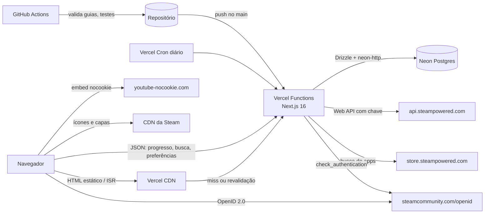
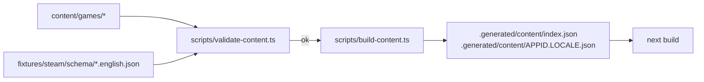

# Completionist: Arquitetura Fullstack

Fase 3 do fluxo AIOX `greenfield-fullstack`, a cargo do @architect (Aria). Base:
`docs/prd.md` (fonte da verdade), `docs/project-brief.md` e `.claude/memory/estado.md`.
Segue o template `fullstack-architecture-tmpl.yaml`, sem as seções que não se aplicam a
um monólito Next.js (ver seção 1.3).

## 1. Introdução

Este documento define como o Completionist é construído: stack com versões, estrutura do
repositório, modelo de dados, integração com a Steam, login, cache, renderização por rota,
formato e validação dos guias, algoritmos de ordenação, segurança, testes, deploy e riscos.
Ele é a referência para o @dev e para o @sm quebrar as stories.

### 1.1 Projeto inicial

Greenfield. O ponto de partida é o `create-next-app` do Next.js 16 (App Router, TypeScript,
ESLint, Tailwind), sem template de terceiros. Nada do sistema-barbearia é reaproveitado
como código; só as práticas (Vercel, Neon, `vercel env pull`, autoria dos commits).

### 1.2 Histórico

| Data | Versão | Descrição | Autor |
|---|---|---|---|
| 2026-09-25 | 1.0 | Primeira versão, a partir do PRD 1.0 | @architect |
| 2026-09-25 | 1.1 | Consistência com o PRD 1.1/1.2 (validação do @po): rota e coluna do "Já mudei", mais rara dos platinados, guia de exemplo, caminhos traduzidos no `revalidatePath` | @po |

### 1.3 Seções do template que não se aplicam

| Seção do template | Motivo |
|---|---|
| GraphQL / tRPC | Não há API pública. As poucas rotas JSON são Route Handlers internos (seção 8). |
| Monorepo, pacotes compartilhados | Um app só; o conteúdo mora em `content/` no mesmo repositório. |
| Servidor tradicional (controllers) | Tudo roda como Vercel Functions (serverless, Fluid compute). |
| Múltiplos ambientes além de dev/preview/produção | Custo zero; não há staging dedicado. |
| Gerenciamento de estado global no cliente (Redux, Zustand) | O estado do cliente é pequeno (spoilers, progresso da página atual); React Context basta. |

## 2. Arquitetura de alto nível

### 2.1 Resumo técnico

O Completionist é um monólito Next.js 16 (App Router) em TypeScript, hospedado na Vercel
no plano Hobby, com Postgres no Neon (plano Free, via Vercel Marketplace). As páginas de
jogo são renderizadas no servidor e guardadas em ISR; o progresso do usuário logado é
carregado no cliente por Route Handlers, para que a página do jogo continue estática para
todo mundo. Os guias são arquivos Markdown e YAML no repositório, validados no CI e
compilados para JSON antes do build. A Steam Web API é a única fonte externa de dados e
fica atrás de um módulo com cache no banco, orçamento diário de chamadas e fixtures para
testes. O login é Steam OpenID 2.0 feito à mão, com verificação `check_authentication` no
servidor e sessão num cookie JWT assinado.

### 2.2 Plataforma e infraestrutura

| Peça | Escolha | Observação |
|---|---|---|
| Hospedagem | Vercel Hobby | Uso não comercial; doações não contam como uso comercial ([fair use](https://vercel.com/docs/limits/fair-use-guidelines)). |
| Região das funções | `iad1` (Washington) | Mesma região do banco; a Steam Web API responde dos EUA; o ISR durável fica na região das funções ([ISR pricing](https://vercel.com/docs/incremental-static-regeneration/limits-and-pricing)). As páginas estáticas saem do CDN perto do usuário, inclusive no Brasil. |
| Banco | Neon Free, `aws-us-east-1` | Integração gerenciada pela Vercel injeta `DATABASE_URL` e `DATABASE_URL_UNPOOLED` ([Neon + Vercel](https://neon.com/docs/guides/vercel-managed-integration)). |
| Domínio | `completionist.lucas-andrade.dev` | Subdomínio do domínio que o Lucas já opera. |
| Analytics | Vercel Web Analytics | Sem cookies; Hobby inclui 50 mil eventos/mês, coleta pausa se estourar ([limites](https://vercel.com/docs/analytics/limits-and-pricing)). |
| Agendamento | Vercel Cron | Hobby: até 100 crons, cada um no máximo 1 vez por dia, com precisão de ±59 min ([cron](https://vercel.com/docs/cron-jobs/usage-and-pricing)). |
| Firewall | Vercel WAF | Hobby: 1 regra de rate limit por projeto, janela de 10 s a 10 min ([WAF](https://vercel.com/docs/vercel-firewall/vercel-waf/rate-limiting)). |

**Limites que moldam o desenho (verificados em 25/09/2026):**

| Limite | Valor | Fonte |
|---|---|---|
| Duração máxima de função (Hobby, Fluid) | 300 s | [duration](https://vercel.com/docs/functions/configuring-functions/duration) |
| Invocações de função (Hobby) | 1 milhão/mês | [fair use](https://vercel.com/docs/limits/fair-use-guidelines) |
| Active CPU (Hobby) | 4 h/mês | idem |
| Fast Data Transfer (Hobby) | 100 GB/mês | idem |
| Otimização de imagem (Hobby) | 5 mil transformações/mês | idem |
| Logs de runtime (Hobby) | retidos por 1 hora | [limits](https://vercel.com/docs/limits) |
| ISR | leitura e escrita cobradas em unidades de 8 KB; escrita só quando o conteúdo muda | [ISR pricing](https://vercel.com/docs/incremental-static-regeneration/limits-and-pricing) |
| Neon: armazenamento | 0,5 GB por projeto; ao estourar, inserts e updates falham | [Neon FAQ](https://neon.com/faqs/free-plan-limits-and-quotas) |
| Neon: computação | 100 CU-hora/mês por projeto; escala a zero após 5 min, sem opção de desligar | idem |
| Neon: transferência | 5 GB/mês | idem |
| Steam Web API | 100 mil chamadas/dia por chave | [termos](https://steamcommunity.com/dev/apiterms) |

Consequências diretas: (1) nada de `next/image` para ícones e capas da Steam, que já vêm
em CDN próprio (evita estourar as 5 mil transformações); (2) o cron diário precisa caber em
300 s e ser idempotente, porque a Vercel não reexecuta cron que falhou e pode entregar o
mesmo disparo duas vezes ([manage cron](https://vercel.com/docs/cron-jobs/manage-cron-jobs));
(3) o banco precisa de política de retenção para caber em 0,5 GB (seção 6.4); (4) logs
somem em 1 hora, então o que importa para diagnóstico vai para tabelas (seção 16).

### 2.3 Estrutura do repositório

Um repositório público, `LucasOlvrAndrade/completionist`, com código (MIT, `LICENSE`) e
guias (CC BY-NC-SA 4.0, `content/LICENSE`). Gerenciador de pacotes: `pnpm`.

### 2.4 Diagrama



### 2.5 Padrões

- **Monólito com fronteiras internas:** `src/server/*` (domínio e integrações, marcado com
  `import 'server-only'`), `src/app/*` (rotas), `src/components/*` (UI). Rotas não chamam a
  Steam diretamente; chamam serviços.
- **Estático primeiro, pessoal no cliente:** a página do jogo é igual para todos e fica em
  ISR; o que depende do usuário (desbloqueios, filtro "o que me falta", preferência de
  spoiler) chega depois, por JSON.
- **Cache-aside no banco para a Steam:** leitura sempre do banco; a Steam só é chamada na
  primeira visita, no cron ou num "Atualizar" do usuário.
- **Conteúdo como código:** guias versionados, validados por schema no CI e compilados para
  JSON no `prebuild`.
- **Funções puras para regras de negócio:** ordenação por dificuldade, roteiro e proximidade
  da platina são funções puras em `src/domain/`, testadas sem banco nem rede.

## 3. Stack

Versões conferidas no registro do npm em 25/09/2026. Travar com `~` (patch) no
`package.json` e atualizar por PR.

| Categoria | Tecnologia | Versão | Por quê |
|---|---|---|---|
| Runtime | Node.js | 24.x LTS (mínimo do Next 16: 20.9) | Padrão atual da Vercel; confirmar em Settings do projeto. |
| Linguagem | TypeScript | 6.0.x | Estável e compatível com o ecossistema do Next 16. O TypeScript 7.0 (nativo) já saiu, mas fica para depois de o `next build` e o `typescript-eslint` confirmarem suporte. |
| Framework | Next.js (App Router) | 16.3.6 | Versão com correção de segurança de 22/09/2026; aplicar a 16.3.7 anunciada para 30/09/2026 ([blog](https://nextjs.org/blog), [npm](https://registry.npmjs.org/next/latest)). |
| UI | React / React DOM | 19.x (a que o Next 16.3 exige) | |
| i18n | next-intl | 4.14.7 | Suporta Next 16 (peer `^16.0.0`); setup com `proxy.ts` ([docs](https://next-intl.dev/docs/getting-started/app-router/with-i18n-routing)). |
| Estilo | Tailwind CSS | 4.3.x | Padrão do `create-next-app`; tokens definidos pelo @ux-design-expert. |
| Banco | Postgres (Neon) | 17 | Versão padrão do Neon para projetos novos. |
| Driver | @neondatabase/serverless | 1.1.0 | Driver HTTP do Neon, sem pool de conexões para gerenciar em serverless. |
| ORM e migrations | drizzle-orm / drizzle-kit | 0.45.3 / 0.31.11 | Ver 3.1. A linha 1.0 ainda está em RC; não adotar agora. |
| Driver local e CI | pg | 8.23.x | Postgres comum no CI e no dev local (ver 3.1). |
| Validação | zod | 4.6.x | Schemas dos guias, das respostas da Steam e das entradas das rotas. |
| Sessão | jose | 6.2.x | JWT HS256 assinado, sem dependência nativa, funciona no runtime Node. |
| Guias | yaml, gray-matter | 2.9.x, 4.0.3 | YAML dos dados neutros e frontmatter dos `.md`. |
| Markdown | unified, remark-parse, remark-gfm, remark-rehype, rehype-sanitize, rehype-stringify | 11 / 11 / 4 / 11 / 6 / 10 | Markdown vira HTML sanitizado no `prebuild`, não no request. |
| Analytics | @vercel/analytics | 2.0.x | NFR11. |
| Testes unitários | Vitest | 5.0.x | Rápido, TypeScript nativo. |
| E2E | Playwright | 1.63.x | Um fluxo (seção 14). |
| Lint | ESLint + eslint-config-next | 10.x / 16.3.6 | `next lint` foi removido no Next 16; roda ESLint direto ([Next 16](https://nextjs.org/blog/next-16)). |
| CI | GitHub Actions | | Lint, tipos, testes, validação dos guias. |
| Deploy | Vercel (Git) | | Deploy automático do `main`; preview por PR. |

### 3.1 Driver e ORM: Drizzle + `@neondatabase/serverless` (HTTP)

**Escolha:** Drizzle ORM com o adaptador `drizzle-orm/neon-http` em produção e preview.

- O driver HTTP do Neon faz cada query como uma requisição HTTP, sem conexão TCP aberta, o
  que combina com funções serverless que sobem e descem. A própria documentação do Drizzle
  recomenda HTTP para queries isoladas e o WebSocket (`neon-serverless`) só quando há
  transação interativa ([Drizzle + Neon](https://orm.drizzle.team/docs/connect-neon)).
  O Completionist não precisa de transação interativa: os upserts em lote usam
  `db.batch([...])`, que o Neon executa numa transação não interativa.
- Drizzle é SQL tipado, sem engine binária nem geração de cliente (ao contrário do Prisma),
  bundle pequeno e cold start baixo. `drizzle-kit` gera migrations SQL versionadas em
  `drizzle/`, que é o que o Story 1.2 pede.
- **Dev local e CI** usam Postgres comum (container `postgres:17`), que o driver HTTP do Neon
  não alcança. O módulo `src/server/db/client.ts` escolhe o adaptador pela URL: host
  `*.neon.tech` usa `neon-http`; qualquer outro usa `drizzle-orm/node-postgres`. O schema é o
  mesmo; só a conexão muda. Migrations rodam com `DATABASE_URL_UNPOOLED` (conexão direta).

## 4. Estrutura do código

```text
completionist/
├── .github/
│   ├── workflows/ci.yml              # lint, tipos, unit, validação dos guias, e2e
│   └── ISSUE_TEMPLATE/correcao.yml   # formulário do "Sugerir correção" (FR15)
├── content/
│   ├── LICENSE                       # CC BY-NC-SA 4.0
│   ├── README.md                     # formato dos guias (Story 2.1)
│   └── games/
│       └── 367520/
│           ├── guide.yaml            # dados neutros de idioma
│           ├── pt-BR.md              # textos em português
│           ├── en.md                 # textos em inglês
│           └── media/                # capturas próprias (webp), se houver
├── fixtures/
│   └── steam/                        # respostas gravadas da Steam (testes e CI)
│       ├── schema/{appid}.{english,brazilian}.json
│       ├── percentages/{appid}.json
│       ├── player/…                  # summaries, owned games, achievements (SteamIDs fictícios)
│       └── storesearch/…
├── drizzle/                          # migrations SQL geradas pelo drizzle-kit
├── messages/
│   ├── pt-BR.json                    # textos da interface
│   └── en.json
├── public/
│   └── privacidade/                  # capturas do passo a passo de perfil privado (FR20)
├── scripts/
│   ├── build-content.ts              # prebuild: guias -> .generated/content/*.json
│   ├── validate-content.ts           # CI: schema, apinames, idiomas, URLs
│   └── steam-snapshot.ts             # local, com chave: grava fixtures de um appid
├── src/
│   ├── proxy.ts                      # next-intl (Next 16 renomeou middleware.ts para proxy.ts)
│   ├── i18n/
│   │   ├── routing.ts                # defineRouting: locales ['pt','en']
│   │   ├── request.ts                # getRequestConfig
│   │   └── navigation.ts             # createNavigation
│   ├── app/
│   │   ├── [locale]/
│   │   │   ├── layout.tsx
│   │   │   ├── page.tsx              # home / vitrine
│   │   │   ├── busca/page.tsx
│   │   │   ├── jogo/[appid]/page.tsx
│   │   │   ├── biblioteca/page.tsx
│   │   │   ├── conta/page.tsx
│   │   │   ├── u/[apelido]/page.tsx
│   │   │   ├── sobre/page.tsx
│   │   │   ├── privacidade/page.tsx
│   │   │   └── not-found.tsx
│   │   └── api/
│   │       ├── auth/steam/login/route.ts
│   │       ├── auth/steam/callback/route.ts
│   │       ├── auth/logout/route.ts
│   │       ├── search/route.ts
│   │       ├── me/route.ts                    # GET sessão+preferências, DELETE conta
│   │       ├── me/preferences/route.ts
│   │       ├── me/progress/[appid]/route.ts   # GET progresso, POST atualizar
│   │       ├── me/library/route.ts            # GET página, POST avançar/atualizar
│   │       ├── me/privacy-check/route.ts      # POST "Já mudei, atualizar" (1/min)
│   │       ├── me/profile/route.ts            # PUT ligar/apelido, DELETE desligar
│   │       ├── visit/[appid]/route.ts         # marca visita recente (cron)
│   │       └── cron/steam-refresh/route.ts
│   ├── components/                   # UI (cartão de conquista, spoiler, barras…)
│   ├── domain/                       # funções puras, 100% testadas
│   │   ├── ordering.ts               # dificuldade, roteiro, blocos de DLC
│   │   ├── proximity.ts              # proximidade da platina
│   │   ├── naming.ts                 # escolha de nome/descrição por idioma
│   │   └── slug.ts                   # validação de apelido
│   ├── content/
│   │   ├── schema.ts                 # zod do guide.yaml e do frontmatter
│   │   ├── parse.ts                  # yaml + md -> Guide
│   │   └── load.ts                   # lê .generated/content
│   └── server/
│       ├── db/{client,schema}.ts
│       ├── steam/
│       │   ├── http.ts               # fetch com chave, timeout, retry, orçamento
│       │   ├── responses.ts          # zod das respostas
│       │   ├── catalog.ts            # ensureGame, refreshGame, search
│       │   ├── player.ts             # summaries, owned, achievements, progress
│       │   └── privacy.ts            # classificação de perfil privado
│       ├── auth/{openid,session}.ts
│       ├── progress.ts               # regras de throttle e persistência
│       └── budget.ts                 # contador diário de chamadas
├── tests/
│   ├── unit/…
│   ├── integration/…                 # rotas com fixtures e Postgres do CI
│   └── e2e/visitor.spec.ts
├── LICENSE                           # MIT
├── drizzle.config.ts
├── next.config.ts
├── vercel.json                       # crons
└── package.json
```

`.generated/` fica no `.gitignore`; é recriado pelo `prebuild`.

## 5. Modelos de dados (visão lógica)

| Entidade | O que guarda | Origem |
|---|---|---|
| `SteamGame` | status do app, nomes, capa, contagem, datas de cache, se tem guia, última visita | Steam + código |
| `SteamAchievement` | apiname, ordem no schema, oculta, ícones, % global | Steam |
| `SteamAchievementText` | nome e descrição por idioma, se é fallback | Steam (`l=brazilian`, `l=english`) |
| `User` | SteamID64, nome, avatar, visibilidade, versão de sessão | Steam OpenID + GetPlayerSummaries |
| `UserPreferences` | spoilers ligados | Usuário |
| `PublicProfile` | apelido, ligado/desligado | Usuário |
| `UserGame` | posse, horas, contagens, pontuação de proximidade, conquista mais rara, datas | Steam |
| `UserAchievement` | desbloqueios detalhados de um jogo aberto | Steam |
| `Guide` | nota, antes de começar, etapas, blocos por conquista | `content/` (não vai para o banco) |

Os guias **não** entram no banco. O brief falava num script que importava os guias; o PRD
decidiu ler no build e este documento segue o PRD. A marcação "jogo tem guia" no banco
(`steam_game.is_guided`) é sincronizada pelo cron a partir da lista compilada, só para o
cron saber o que priorizar.

```ts
// src/content/types.ts (resumo)
export type Locale = 'pt-BR' | 'en';
export interface Guide {
  appid: number;
  meta: GuideMeta;                        // de guide.yaml
  text: Partial<Record<Locale, GuideText>>; // de pt-BR.md / en.md
}
```

## 6. Esquema do banco

DDL de referência (o @dev escreve em Drizzle; o SQL gerado deve bater com isto).

```sql
-- Cache da Steam -------------------------------------------------------------

CREATE TYPE app_status AS ENUM ('ok', 'no_achievements', 'not_found');

CREATE TABLE steam_game (
  appid                  integer PRIMARY KEY CHECK (appid > 0),
  status                 app_status NOT NULL,
  name_en                text,
  name_pt                text,
  header_image_url       text,
  achievement_count      integer NOT NULL DEFAULT 0,
  is_guided              boolean NOT NULL DEFAULT false,
  schema_fetched_at      timestamptz,          -- último GetSchemaForGame (2 idiomas)
  percentages_fetched_at timestamptz,          -- último GetGlobalAchievementPercentagesForApp
  schema_hash            text,                 -- hash dos apinames, detecta conquista nova
  last_visited_at        timestamptz,          -- atualizado no máximo 1x/h por jogo
  fail_count             smallint NOT NULL DEFAULT 0,
  next_retry_at          timestamptz,          -- cache negativo e backoff
  created_at             timestamptz NOT NULL DEFAULT now(),
  updated_at             timestamptz NOT NULL DEFAULT now()
);
CREATE INDEX steam_game_refresh_idx ON steam_game (percentages_fetched_at)
  WHERE status = 'ok';
CREATE INDEX steam_game_visited_idx ON steam_game (last_visited_at)
  WHERE status = 'ok' AND is_guided = false;

CREATE TABLE steam_achievement (
  appid          integer NOT NULL REFERENCES steam_game(appid) ON DELETE CASCADE,
  apiname        text    NOT NULL,
  display_order  integer NOT NULL,             -- posição no schema da Steam (desempate estável)
  hidden         boolean NOT NULL,
  icon_url       text    NOT NULL,
  icon_gray_url  text    NOT NULL,
  global_percent numeric(6,3),                 -- 0.000 a 100.000; NULL se a Steam não informou
  removed_at     timestamptz,                  -- sumiu do schema; mantida para não quebrar progresso
  PRIMARY KEY (appid, apiname)
);

CREATE TABLE steam_achievement_text (
  appid       integer NOT NULL,
  apiname     text    NOT NULL,
  locale      text    NOT NULL CHECK (locale IN ('pt-BR', 'en')),
  name        text    NOT NULL,
  description text,                            -- ocultas podem vir sem descrição
  is_fallback boolean NOT NULL DEFAULT false,  -- pt-BR igual ao en: a Steam não tem tradução
  PRIMARY KEY (appid, apiname, locale),
  FOREIGN KEY (appid, apiname) REFERENCES steam_achievement(appid, apiname) ON DELETE CASCADE
);

-- Usuários -------------------------------------------------------------------

CREATE TABLE app_user (
  steamid             text PRIMARY KEY CHECK (steamid ~ '^7656119[0-9]{10}$'),
  persona_name        text NOT NULL,
  avatar_url          text,
  profile_state       text NOT NULL DEFAULT 'unknown'
                      CHECK (profile_state IN ('public','profile_private','games_private','unknown')),
  session_version     integer NOT NULL DEFAULT 1,  -- incrementar invalida sessões
  library_fetched_at  timestamptz,                 -- throttle de 1 h da biblioteca (NFR3)
  privacy_checked_at  timestamptz,                 -- throttle de 1 min do "Já mudei" (NFR3)
  created_at          timestamptz NOT NULL DEFAULT now(),
  last_login_at       timestamptz NOT NULL DEFAULT now()
);

CREATE TABLE user_preferences (
  steamid       text PRIMARY KEY REFERENCES app_user(steamid) ON DELETE CASCADE,
  show_spoilers boolean NOT NULL DEFAULT false,
  updated_at    timestamptz NOT NULL DEFAULT now()
);

CREATE TABLE public_profile (
  steamid    text PRIMARY KEY REFERENCES app_user(steamid) ON DELETE CASCADE,
  slug       text NOT NULL CHECK (slug ~ '^[a-z0-9][a-z0-9_-]{2,23}$'),  -- guardado já em minúsculas
  enabled    boolean NOT NULL DEFAULT true,
  created_at timestamptz NOT NULL DEFAULT now(),
  updated_at timestamptz NOT NULL DEFAULT now()
);
CREATE UNIQUE INDEX public_profile_slug_uq ON public_profile (slug);

CREATE TYPE progress_status AS ENUM ('ok', 'games_private', 'not_owned', 'no_stats', 'error');
CREATE TYPE score_precision AS ENUM ('estimated', 'exact');

CREATE TABLE user_game (
  steamid                 text    NOT NULL REFERENCES app_user(steamid) ON DELETE CASCADE,
  appid                   integer NOT NULL,     -- sem FK: o jogo pode não estar no cache ainda
  playtime_minutes        integer NOT NULL DEFAULT 0,
  last_played_at          timestamptz,
  unlocked_count          integer NOT NULL DEFAULT 0,
  total_count             integer NOT NULL DEFAULT 0,
  proximity_score         integer,              -- milésimos (seção 11.3); NULL se não calculado
  score_precision         score_precision,
  rarest_unlocked_apiname text,                 -- perfil público (FR24)
  status                  progress_status NOT NULL DEFAULT 'ok',
  progress_fetched_at     timestamptz,          -- throttle de 5 min (NFR3)
  detail_fetched_at       timestamptz,          -- último GetPlayerAchievements
  PRIMARY KEY (steamid, appid)
);
CREATE INDEX user_game_library_idx ON user_game (steamid, proximity_score)
  WHERE total_count > 0;
CREATE INDEX user_game_profile_idx ON user_game (steamid)
  WHERE total_count > 0 AND unlocked_count * 2 > total_count;

CREATE TABLE user_achievement (
  steamid     text    NOT NULL,
  appid       integer NOT NULL,
  apiname     text    NOT NULL,
  unlocked_at timestamptz,                      -- unlocktime da Steam (0 vira NULL)
  PRIMARY KEY (steamid, appid, apiname),
  FOREIGN KEY (steamid, appid) REFERENCES user_game(steamid, appid) ON DELETE CASCADE
);

-- Operação -------------------------------------------------------------------

CREATE TABLE steam_api_usage (
  day      date NOT NULL,                       -- UTC
  endpoint text NOT NULL,                       -- ex.: 'GetSchemaForGame'
  calls    integer NOT NULL DEFAULT 0,
  errors   integer NOT NULL DEFAULT 0,
  PRIMARY KEY (day, endpoint)
);

CREATE TABLE cron_run (
  id            bigserial PRIMARY KEY,
  job           text NOT NULL,
  started_at    timestamptz NOT NULL DEFAULT now(),
  finished_at   timestamptz,
  games_done    integer NOT NULL DEFAULT 0,
  games_pending integer NOT NULL DEFAULT 0,
  steam_calls   integer NOT NULL DEFAULT 0,
  errors        jsonb NOT NULL DEFAULT '[]'
);
```

### 6.1 Por que só as conquistas desbloqueadas

`user_achievement` guarda só o que foi desbloqueado, e só dos jogos que o usuário abriu na
página do jogo. A biblioteca usa as contagens de `user_game`. Guardar o detalhe de toda a
biblioteca de todos os usuários não cabe em 0,5 GB (ver 6.4).

### 6.2 Apelido

O apelido é guardado em minúsculas (a normalização é `slug.ts`, que também remove acentos
e troca espaço por hífen na sugestão vinda do nome Steam). Lista de apelidos reservados no
código: `admin`, `api`, `conta`, `biblioteca`, `busca`, `jogo`, `sobre`, `privacidade`, `u`,
`account`, `library`, `search`, `game`, `about`, `privacy`, `me`, `completionist`, `steam`,
`valve`. A regex do banco exige começar por letra ou número (FR23). Troca de apelido libera o antigo na hora (sem histórico,
fora do escopo do PRD).

### 6.3 Apagar conta (FR22)

`DELETE FROM app_user WHERE steamid = $1` apaga preferências, perfil, `user_game` e
`user_achievement` em cascata. Depois, `revalidatePath` do perfil público (se existia) e o
cookie é apagado. Uma sessão antiga em outro navegador falha na próxima requisição, porque o
usuário não existe mais (seção 13.2).

### 6.4 Tamanho e retenção (0,5 GB)

| Dado | Estimativa por item | Volume de referência | Total |
|---|---|---|---|
| Conquistas de um jogo (2 idiomas, textos, ícones) | cerca de 40 KB por jogo de 60 conquistas | 3 mil jogos em cache | cerca de 120 MB |
| `user_game` | cerca de 150 B por linha | 1 mil usuários × 300 jogos | cerca de 45 MB |
| `user_achievement` | cerca de 80 B por linha | 1 mil usuários × 20 jogos abertos × 40 | cerca de 64 MB |
| Índices e sobra | | | cerca de 30% |

Cabe com folga no lançamento. Regras de retenção no cron diário:

1. Jogo sem guia, sem visita há 90 dias e fora de qualquer `user_game`: apaga conquistas e
   textos, mantém a linha de `steam_game` com `schema_fetched_at = NULL` (volta na próxima
   visita).
2. `user_achievement` de jogo cujo `detail_fetched_at` passou de 180 dias: apaga (o
   progresso volta no próximo "Atualizar").
3. `steam_api_usage` e `cron_run` com mais de 90 dias: apaga.
4. O cron grava em `cron_run` o tamanho do banco (`pg_database_size`); acima de 400 MB, o
   log registra alerta e a regra 1 cai para 30 dias.

## 7. Formato dos guias

### 7.1 Arquivos

Cada guia tem três arquivos em `content/games/{appid}/` (PRD 1.1, seção 4 e Story 2.1):
`guide.yaml`, com tudo o que não depende de idioma (nota, dificuldades, etiquetas, vídeos,
fotos, fontes, DLC, etapas), e `pt-BR.md` e `en.md`, só com texto. Motivo: sem o YAML, cada
dificuldade, vídeo e fonte seria escrito duas vezes (137 conquistas no Terraria) e os dois
arquivos divergiriam.

### 7.2 `guide.yaml`

```yaml
appid: 367520
revisado_em: 2026-10-10
exemplo: false            # true só no guia de testes (Story 2.1); fica fora da vitrine em produção
nota:
  dificuldade: 7          # 1 a 10
  horas: 60               # estimativa para 100%
  jogadas: 1
  completo: true          # selo "guia completo"
dlcs:                     # blocos separados (FR13); ordem de exibição
  - id: godmaster
    steam_appids: [916000] # opcional, informativo
etapas:                   # roteiro (FR11); ordem de exibição
  - id: inicio
  - id: meio
    spoiler: true          # nome da etapa passa pelo filtro de spoiler
  - id: pos-final
    spoiler: true
conquistas:
  - apiname: FK_DEFEAT
    dificuldade: 2         # 1 a 5, opcional
    tempo_min: 20          # opcional
    perdivel: false
    grind: false
    dlc: null              # ou o id de um item de `dlcs`
    etapa: inicio          # ou null
    ordem_roteiro: 1       # opcional, ordem dentro da etapa
    video:
      youtube_id: dQw4w9WgXcQ   # 11 caracteres
      inicio_s: 754
    fotos:
      - arquivo: media/fk-arena.webp     # relativo à pasta do jogo
        origem: autor                    # autor | usuario (FR14)
        credito: Lucas de Oliveira Andrade
        legenda: { pt-BR: "Entrada da arena", en: "Arena entrance" }
    fontes:
      - https://hollowknight.wiki/w/False_Knight
      - https://steamcommunity.com/sharedfiles/filedetails/?id=0000000000
```

### 7.3 `pt-BR.md` e `en.md`

```markdown
---
locale: pt-BR
seo:
  titulo: "Guia de platina de Hollow Knight"
  descricao: "Todas as 63 conquistas, da mais fácil à mais difícil…"
etapas:
  inicio: "Começo da jornada"
  meio: "Coração de Hallownest"
  pos-final: "Depois do final"
dlcs:
  godmaster: "Godmaster"
nomes:                     # FR16: só quando a Steam não tem o nome neste idioma
  FK_DEFEAT: "Falso Cavaleiro"
---

## antes-de-comecar

### Perdíveis
…
### Dificuldade
…
### Backups de save
…
### DLC
…

## conquista: FK_DEFEAT

Passo a passo em Markdown (listas, negrito, links). Sem HTML bruto.

## conquista: HORNET_1
…
```

Regras do parser: o corpo é dividido pelas linhas `## ` de nível 2. `## antes-de-comecar`
aparece no máximo uma vez; cada `## conquista: APINAME` aparece no máximo uma vez. Dentro de
cada bloco vale Markdown com GFM. HTML bruto é descartado pelo `rehype-sanitize`. Os quatro
subtítulos do "Antes de começar" são texto livre, e o componente mostra o bloco como veio.

### 7.4 Schema (zod, esboço)

```ts
// src/content/schema.ts
import { z } from 'zod';

const apiname = z.string().regex(/^[A-Za-z0-9_.\-]{1,128}$/);
const slugId = z.string().regex(/^[a-z0-9-]{1,40}$/);
const locale = z.enum(['pt-BR', 'en']);

export const GuideMetaSchema = z.object({
  appid: z.number().int().positive(),
  revisado_em: z.iso.date(),
  exemplo: z.boolean().default(false),
  nota: z.object({
    dificuldade: z.number().int().min(1).max(10),
    horas: z.number().positive().max(2000),
    jogadas: z.number().int().min(1).max(20),
    completo: z.boolean(),
  }),
  dlcs: z.array(z.object({ id: slugId, steam_appids: z.array(z.number().int()).optional() })).default([]),
  etapas: z.array(z.object({ id: slugId, spoiler: z.boolean().default(false) })).default([]),
  conquistas: z.array(z.object({
    apiname,
    dificuldade: z.number().int().min(1).max(5).optional(),
    tempo_min: z.number().int().positive().optional(),
    perdivel: z.boolean().default(false),
    grind: z.boolean().default(false),
    dlc: slugId.nullable().default(null),
    etapa: slugId.nullable().default(null),
    ordem_roteiro: z.number().int().positive().optional(),
    video: z.object({
      youtube_id: z.string().regex(/^[A-Za-z0-9_-]{11}$/),
      inicio_s: z.number().int().min(0),
    }).optional(),
    fotos: z.array(z.object({
      arquivo: z.string().regex(/^media\/[a-z0-9-]+\.(webp|png|jpg)$/),
      origem: z.enum(['autor', 'usuario']),
      credito: z.string().min(1),
      legenda: z.record(locale, z.string()).optional(),
    })).default([]),
    fontes: z.array(z.url({ protocol: /^https$/ })).min(1),   // NFR4: toda conquista cita fontes
  })),
}).superRefine((g, ctx) => {
  // apinames únicos; dlc e etapa referenciam ids declarados
});

export const GuideTextFrontmatterSchema = z.object({
  locale,
  seo: z.object({ titulo: z.string().max(70), descricao: z.string().max(160) }),
  etapas: z.record(slugId, z.string().min(1)).default({}),
  dlcs: z.record(slugId, z.string().min(1)).default({}),
  nomes: z.record(apiname, z.string().min(1)).default({}),
});
```

### 7.5 Pipeline de build e validação



`validate-content.ts` (roda no CI em todo PR e no `prebuild`) falha quando:

1. `guide.yaml` ou o frontmatter não passam no zod.
2. Algum `apiname` do guia não existe no snapshot `fixtures/steam/schema/{appid}.english.json`.
   O snapshot é gravado pelo `pnpm steam:snapshot {appid}` na máquina do Lucas (usa a chave
   do `.env.local`, nunca roda no CI) e commitado junto com o guia. O CI não chama a Steam.
3. Falta `pt-BR.md` ou `en.md` num jogo marcado `completo: true` (os 14 do lançamento).
   Guia sem `completo` pode ter um idioma só; a página mostra o aviso do FR28.
4. Um `.md` tem `## conquista:` de apiname que não está no `guide.yaml`, ou etapa/DLC sem nome
   no frontmatter daquele idioma.
5. `youtube_id` fora do formato, `fontes` vazia ou não HTTPS, foto apontando para arquivo que
   não existe em `media/`.
6. Num jogo `completo: true`, alguma conquista do snapshot fica sem bloco no guia (Story 2.1,
   item 4). Em guia sem `completo`, isso é só aviso.

`build-content.ts` converte o Markdown em HTML sanitizado e grava JSON. As páginas importam
esse JSON, que entra no bundle da função: a revalidação ISR em runtime não depende de ler
`content/` do disco.

Vídeo: o CI só valida o formato do ID. Checar se o vídeo ainda existe exigiria chamar o
YouTube; fica como verificação manual no "Sugerir correção".

## 8. Rotas e API interna

### 8.1 Páginas e estratégia de renderização

O `cacheComponents` do Next 16 (PPR com `"use cache"`) fica **desligado** no MVP. O modelo
clássico de ISR (`revalidate`, `generateStaticParams`, `revalidatePath`) continua suportado no
Next 16.3 ([ISR](https://nextjs.org/docs/app/guides/incremental-static-regeneration)) e é
mais simples de prever no plano Hobby. O pessoal vai para o cliente. Reavaliar Cache
Components depois do lançamento.

As rotas abaixo estão pelo caminho **interno** (pasta em `app/[locale]/`, sempre com o
segmento em português). O caminho público de cada idioma vem do `pathnames` (12.1): por
exemplo, `/[locale]/jogo/[appid]` publica `/pt/jogo/{appid}` e `/en/game/{appid}`.

| Rota | Renderização | Cache e invalidação |
|---|---|---|
| `/` | Proxy do next-intl redireciona pelo `Accept-Language` (FR26) | |
| `/[locale]` (home) | Estática no build | Novo deploy (vitrine vem do conteúdo compilado) |
| `/[locale]/busca` | Casca estática + busca no cliente via `/api/search` | Resposta da busca com cache de dados de 24 h |
| `/[locale]/jogo/[appid]` | ISR. `generateStaticParams` gera os jogos com guia × 2 idiomas; `dynamicParams = true` gera os demais na primeira visita | `revalidate = 86400`; o cron chama `revalidatePath` dos jogos que mudaram |
| `/[locale]/biblioteca` | Dinâmica (lê a sessão) | Sem cache de página |
| `/[locale]/conta` | Dinâmica | Sem cache de página |
| `/[locale]/u/[apelido]` | ISR com `dynamicParams = true`, `revalidate = 3600` | `revalidatePath` ao ligar, desligar, trocar apelido e atualizar progresso |
| `/[locale]/sobre`, `/privacidade` | Estáticas | Deploy |

Detalhes da página do jogo:

- A página chama `ensureGame(appid)` (seção 9.3). Se a Steam responde que o app não tem
  conquistas ou não existe, `notFound()`: o 404 fica em cache, o que é o comportamento certo.
  Se a Steam falha (timeout, 5xx, 429), a página lança erro, o Next **não** grava a versão com
  erro e continua servindo a última boa ([ISR, exceções](https://nextjs.org/docs/app/guides/incremental-static-regeneration)).
- Nada de `new Date()` ou valores aleatórios no HTML da página, para não gerar escrita ISR à
  toa ([ISR pricing](https://vercel.com/docs/incremental-static-regeneration/limits-and-pricing)).
  A data "atualizado em" do cache da Steam vem do banco, não do relógio.
- `last_visited_at` (usado pelo cron) não é atualizado na renderização, que é rara por causa
  do ISR. Quem atualiza é o cliente: um `navigator.sendBeacon('/api/visit/{appid}')` sem
  cookies, com escrita no máximo 1 vez por hora por jogo (`UPDATE … WHERE last_visited_at <
  now() - interval '1 hour'`). Rota adicional: `POST /api/visit/[appid]`.
- Metadados (NFR10): `generateMetadata` com título e descrição do `seo` do guia (ou nome do jogo
  sem guia), Open Graph com a capa da Steam, `alternates.languages` com `pt-BR` e `en` para o
  `hreflang`.
- `appid` é validado com `z.coerce.number().int().min(1).max(2_147_483_647)` antes de qualquer
  consulta; fora disso, 404.

### 8.2 Route Handlers

| Método e rota | Auth | Faz | Resposta |
|---|---|---|---|
| `GET /api/auth/steam/login?next=` | não | Monta a URL OpenID e redireciona | 302 |
| `GET /api/auth/steam/callback` | não | Verifica, cria usuário, grava cookie | 302 para `next` |
| `POST /api/auth/logout` | sim | Apaga o cookie | 204 |
| `GET /api/me` | opcional | Usuário, preferências, estado do perfil Steam | 200 `{ user: null }` se visitante |
| `DELETE /api/me` | sim | Apaga a conta | 204 |
| `PATCH /api/me/preferences` | sim | `{ showSpoilers: boolean }` | 200 |
| `GET /api/me/progress/[appid]` | sim | Progresso do jogo (busca na Steam se nunca buscou) | 200 `{ status, unlocked: {apiname: unlockedAt}, fetchedAt, nextRefreshAt }` |
| `POST /api/me/progress/[appid]` | sim | "Atualizar"; respeita 5 min | 200, ou 429 com `Retry-After` e os dados em cache |
| `GET /api/me/library?cursor=` | sim | Página da biblioteca ordenada | 200 `{ items, nextCursor, pendingRefinement }` |
| `POST /api/me/library` | sim | Busca a biblioteca na Steam ou refina o próximo lote; a busca completa respeita 1 h (`library_fetched_at`) | 200, ou 429 com `Retry-After` |
| `POST /api/me/privacy-check` | sim | "Já mudei, atualizar": refaz os passos 1 e 2 de 9.5; 1 vez por minuto (`privacy_checked_at`) | 200 `{ profileState }`, ou 429 com `Retry-After` |
| `PUT /api/me/profile` | sim | Liga o perfil e define ou troca o apelido | 200, 409 se o apelido existe |
| `DELETE /api/me/profile` | sim | Desliga o perfil | 204 |
| `GET /api/search?q=&locale=` | não | Busca de jogos | 200 `{ items: [{appid, name, image, guided}] }` |
| `POST /api/visit/[appid]` | não | Marca visita (cron) | 204 |
| `GET /api/cron/steam-refresh` | `CRON_SECRET` | Atualização diária | 200 com resumo |

As telas de configuração da conta podem usar Server Actions em vez das rotas `PUT/DELETE`;
as duas formas passam pelo mesmo serviço em `src/server/`. Erros seguem um formato único:
`{ error: { code: 'RATE_LIMITED' | 'UNAUTHENTICATED' | 'STEAM_UNAVAILABLE' | 'VALIDATION' | 'NOT_FOUND' | 'CONFLICT', message } }`.

## 9. Integração com a Steam

### 9.1 Endpoints usados

| Uso | Endpoint | Parâmetros | Chave | Notas |
|---|---|---|---|---|
| Schema (nomes, descrições, ícones, oculta) | `ISteamUserStats/GetSchemaForGame/v2` | `appid`, `l=brazilian` ou `l=english` | sim | Códigos de idioma da Steam: `brazilian` e `english` ([idiomas](https://partner.steamgames.com/doc/store/localization/languages), [ISteamUserStats](https://partner.steamgames.com/doc/webapi/ISteamUserStats)). |
| % global | `ISteamUserStats/GetGlobalAchievementPercentagesForApp/v2` | `gameid` | não | Testado em 25/09/2026: `percent` vem como **string** (`"76.8"`); app sem conquistas responde `{}` com HTTP 403. |
| Progresso num jogo | `ISteamUserStats/GetPlayerAchievements/v1` | `steamid`, `appid`, `l` | sim | 403 `"Profile is not public"` também quando o usuário **não possui** o jogo (ver 9.5). |
| Perfil | `ISteamUser/GetPlayerSummaries/v2` | `steamids` (até 100) | sim | `communityvisibilitystate` 3 = público. |
| Biblioteca | `IPlayerService/GetOwnedGames/v1` | `steamid`, `include_appinfo=1`, `include_played_free_games=1`, `skip_unvetted_apps=0` | sim | Detalhes de jogos privados: resposta `{"response":{}}` sem `game_count`. |
| Progresso em lote | `IPlayerService/GetAchievementsProgress/v1` | `steamid`, `appids[]`, `language` | sim | Não documentado no Steamworks, listado por quem mapeia a API ([xPaw](https://steamapi.xpaw.me/IPlayerService)). Usado só como aceleração da biblioteca, com alternativa (9.6). |
| Busca de jogos | `store.steampowered.com/api/storesearch/?term=&l=&cc=` | termo, idioma, país | não | Não documentado, sem chave, usado pela própria loja. Testado em 25/09/2026. |
| Contagem de conquistas (apoio) | `store.steampowered.com/api/appdetails?appids=&filters=achievements` | | não | Fallback se a sondagem por % falhar. |

**Lista de apps:** `ISteamApps/GetAppList` está marcado como obsoleto ("can no longer scale
to the number of items available on Steam") e a Valve indica `IStoreService/GetAppList`
([ISteamApps](https://partner.steamgames.com/doc/webapi/ISteamApps)). Nenhum dos dois é
usado no MVP: baixar e indexar o catálogo inteiro custaria armazenamento e não diria quais
apps têm conquistas. A busca usa o `storesearch`, que já traz relevância, nome localizado e
capa. Se ele sair do ar, o plano B é um índice local por `IStoreService/GetAppList` com
`pg_trgm` (risco R2).

### 9.2 Cliente HTTP (`src/server/steam/http.ts`)

- Toda chamada passa por uma função só, que injeta a chave (`STEAM_API_KEY`, só no servidor),
  aplica timeout de 8 s (`AbortSignal.timeout`), repete uma vez em 429/5xx com espera de 1 s
  com jitter e valida a resposta com zod (`responses.ts`).
- A chave nunca aparece em log: a URL é registrada sem o parâmetro `key`.
- Cada chamada incrementa `steam_api_usage` (upsert por dia e endpoint). Para não fazer uma
  escrita por chamada, o contador é acumulado em memória durante a requisição e gravado uma
  vez no fim (`after()` do Next).
- **Orçamento diário** (`budget.ts`): limite configurável `STEAM_DAILY_BUDGET` (padrão 80 mil,
  20% abaixo dos 100 mil). Três faixas:
  - abaixo de 70%: tudo normal;
  - de 70% a 100% do orçamento: o cron para de atualizar jogos "visitados recentemente" e a
    biblioteca não refina novos lotes; usuário e primeira visita seguem;
  - acima do orçamento: só leitura do banco; primeira visita a jogo novo mostra "tente mais
    tarde" (erro, não 404); "Atualizar" responde 503 com os dados em cache.
- O cliente recebe `fetchImpl` por injeção, o que permite os testes com fixtures (seção 14).

### 9.3 Catálogo: `ensureGame` e `refreshGame`

```text
ensureGame(appid):
  row = SELECT steam_game
  se row.status = 'ok' e row.schema_fetched_at não é NULL: retorna do banco
  se row.status em ('no_achievements','not_found') e now() < row.next_retry_at: 404
  senão: refreshGame(appid, full=true)

refreshGame(appid, full):
  pct = GetGlobalAchievementPercentagesForApp(appid)          # 1 chamada, sem chave
  se pct vazio (403 ou {}):
      grava status='no_achievements', next_retry_at = now() + 7 dias; fim
  hash = sha1(apinames de pct ordenados)
  se full ou hash != row.schema_hash ou schema_fetched_at < now() - 7 dias:
      en = GetSchemaForGame(appid, 'english')                 # 1 chamada
      pt = GetSchemaForGame(appid, 'brazilian')               # 1 chamada
      se en sem achievements: status='no_achievements' (idem acima); fim
      upsert steam_achievement (display_order = índice em en)
      upsert steam_achievement_text: pt.is_fallback = (pt.name == en.name e pt.description == en.description)
      marca removed_at nas que sumiram
      schema_fetched_at = now(), schema_hash = hash
  atualiza global_percent de todas; percentages_fetched_at = now()
  tudo num db.batch (transação não interativa)
```

- `name_en`, `name_pt` e a capa vêm do `appdetails` (uma chamada por idioma, só na primeira
  vez) ou do resultado da busca, quando o jogo foi aberto por ela. A capa usa o
  `header_image` da Steam.
- A busca de jogos da Steam retorna trilhas sonoras e DLCs como `type: "app"`. Para cumprir
  "só jogos com conquistas" (Story 1.4), cada resultado passa por uma sondagem: se já está em
  `steam_game`, usa o status; senão, chama `GetGlobalAchievementPercentagesForApp` (sem
  chave) e grava o status. Resultados do mesmo termo ficam no Data Cache do Next por 24 h
  (`fetch(..., { next: { revalidate: 86400 } })`).

### 9.4 Política de cache

| Evento | O que busca | Frequência |
|---|---|---|
| Primeira visita a um jogo | % + schema nos 2 idiomas (3 chamadas) + `appdetails` | Uma vez |
| Cron diário, jogos com guia | % sempre; schema se o hash mudou ou a cada 7 dias | 1 vez por dia |
| Cron diário, visitados nos últimos 30 dias | Idem | 1 vez por dia, enquanto houver tempo e orçamento |
| Login | `GetPlayerSummaries` + `GetOwnedGames` + progresso em lote | A cada login |
| Abrir um jogo logado | `GetPlayerAchievements` se nunca buscou esse jogo ou se o último login é mais novo que a última busca | Sob demanda |
| "Atualizar" no jogo | `GetPlayerAchievements` | No máximo 1 vez a cada 5 min por jogo (NFR3) |
| "Atualizar" na biblioteca | `GetOwnedGames` + progresso em lote | No máximo 1 vez por hora (NFR3) |
| "Já mudei, atualizar" (perfil privado) | `GetPlayerSummaries` + `GetOwnedGames` | No máximo 1 vez por minuto por usuário (NFR3) |

Os três limites são aplicados no servidor: 5 min por jogo com `user_game.progress_fetched_at`,
1 h da biblioteca com `app_user.library_fetched_at` e 1 min do "Já mudei" com
`app_user.privacy_checked_at`. Dentro da janela, a rota devolve os dados em cache com
`nextRefreshAt` (ou 429 com `Retry-After`), e o botão mostra quando pode tentar de novo.

### 9.5 Detecção de perfil privado (FR20, Story 3.3)

A Steam não diferencia bem "privado" de "não tem o jogo": `GetPlayerAchievements` responde 403
`"Profile is not public"` nos dois casos ([relato verificado contra a API](https://github.com/cg1618-apps/media/pull/47)).
Regra, em ordem:

1. `GetPlayerSummaries.communityvisibilitystate != 3` → `profile_private` (perfil inteiro
   privado).
2. Perfil público, mas `GetOwnedGames` sem `game_count` → `games_private` (detalhes de jogos
   privados). `game_count: 0` é biblioteca vazia de verdade, não privado.
3. Num jogo específico, 403 em `GetPlayerAchievements`:
   - se o appid está na lista de jogos do usuário → `games_private` para aquele jogo (o usuário
     pode ter marcado só esse jogo como privado na biblioteca);
   - se a lista é conhecida e o appid não está → `not_owned` ("Você não tem este jogo na
     biblioteca"), sem aviso de privacidade;
   - se a lista é desconhecida (caso 2) → `games_private`.
4. 400 `"Requested app has no stats"` → `no_stats`.

`profile_private` e `games_private` mostram o aviso com passo a passo e capturas
(`public/privacidade/*.webp`) e o botão "Já mudei, atualizar" (`POST /api/me/privacy-check`),
que refaz os passos 1 e 2 ignorando o limite de 5 min, mas com limite de 1 vez por minuto por
usuário (`privacy_checked_at`). A lista de jogos do passo 3 vem do `GetOwnedGames` feito no
login (PRD Story 3.1, item 6), por isso a Story 3.3 não depende da biblioteca (3.4).

### 9.6 Biblioteca (Story 3.4)

```text
POST /api/me/library (refresh):
  1. GetOwnedGames                                      1 chamada
  2. filtra has_community_visible_stats = true
  3. GetAchievementsProgress em lotes de 100 appids     ceil(n/100) chamadas
     -> unlocked_count, total_count por jogo
     falhou ou endpoint sumiu? marca pendingRefinement e segue pelo passo 5
  4. score estimado (11.3) para todos; grava user_game
POST /api/me/library (refine), chamado pelo cliente enquanto pendingRefinement:
  5. pega os próximos 15 jogos com 0 < faltando, ordenados pelo score estimado
     para cada um: GetPlayerAchievements (1) + garante % global no cache (0 ou 1)
     calcula score exato, grava rarest_unlocked_apiname e user_achievement
  6. platinados (faltando = 0) sem rarest_unlocked_apiname: como U = A, a mais rara
     desbloqueada é a de menor % global do jogo; garante o cache do jogo (0 a 3 chamadas)
     e grava, sem GetPlayerAchievements
```

Jogo acima de 50% ainda não refinado aparece no perfil público sem o ícone da mais rara
(espaço reservado), até o refino chegar nele; como a ordem do refino é pelo score, esses
jogos estão entre os primeiros refinados.

Cada chamada de refino cabe folgada em 300 s. O cliente mostra primeiro a lista estimada e vai
trocando pela exata ("carregamento progressivo", AC 3). Biblioteca de 500 jogos com conquistas:
cerca de 6 chamadas na atualização e até cerca de 1.000 no refino completo, que só acontece
enquanto o usuário está na página. Com o orçamento de 80 mil por dia, isso comporta dezenas
de refinamentos completos por dia, e o refino para na faixa de 70% (9.2).

### 9.7 Cron diário

`vercel.json`:

```json
{
  "crons": [
    { "path": "/api/cron/steam-refresh", "schedule": "0 6 * * *" }
  ]
}
```

06:00 UTC (03:00 em Brasília), com a imprecisão de até 59 min do Hobby. Rota com
`export const maxDuration = 300`, protegida por `Authorization: Bearer ${CRON_SECRET}`
([manage cron](https://vercel.com/docs/cron-jobs/manage-cron-jobs)).

```text
1. trava: INSERT em cron_run; se existe execução sem finished_at iniciada há menos de 10 min, sai
   (evita duas execuções simultâneas se a Vercel entregar o disparo duas vezes)
2. sincroniza steam_game.is_guided com a lista compilada
3. fila = jogos com guia + jogos com last_visited_at nos últimos 30 dias,
   ordenada por (is_guided desc, percentages_fetched_at asc nulls first)
   pula quem já foi atualizado nas últimas 20 h (idempotência)
4. processa com concorrência 6, até 240 s de relógio ou faixa de orçamento de 70%
5. revalidatePath('/pt/jogo/{appid}') e ('/en/jogo/{appid}') dos jogos cujo conteúdo mudou
   (caminho interno, depois do rewrite do next-intl; o público em inglês é /en/game/{appid}.
   Um teste de integração confere que as duas URLs públicas são invalidadas)
6. retenção (6.4)
7. fecha cron_run com totais e o que ficou pendente
```

Estimativa: cerca de 300 ms por chamada e 1,2 chamada por jogo em média (o schema só é
rebuscado quando muda) dão cerca de 700 jogos por execução. O que não coube fica primeiro na
fila do dia seguinte, porque a fila é ordenada pelo mais antigo. Se isso virar rotina, basta
acrescentar um segundo cron em outro horário (o Hobby permite até 100, cada um diário).

## 10. Autenticação: Steam OpenID 2.0

Endpoint do provedor: `https://steamcommunity.com/openid/login`; o `claimed_id` volta como
`https://steamcommunity.com/openid/id/<steamid64>` ([Steamworks auth](https://partner.steamgames.com/doc/features/auth)).
A documentação ainda mostra `http://` no `claimed_id`; o parser aceita os dois esquemas.

```mermaid
sequenceDiagram
    autonumber
    participant B as Navegador
    participant A as Completionist (/api/auth/steam)
    participant S as steamcommunity.com/openid
    participant W as Steam Web API
    participant D as Neon
    B->>A: GET /login?next=/pt/jogo/367520
    A->>A: gera state (32 bytes), valida next (só caminho relativo do próprio site)
    A-->>B: 302 para S + Set-Cookie oid_state (HttpOnly, Secure, SameSite=Lax, 10 min)
    Note over A,B: openid.ns=http://specs.openid.net/auth/2.0<br/>openid.mode=checkid_setup<br/>openid.return_to=https://completionist.lucas-andrade.dev/api/auth/steam/callback?state=...<br/>openid.realm=https://completionist.lucas-andrade.dev<br/>openid.identity=openid.claimed_id=http://specs.openid.net/auth/2.0/identifier_select
    B->>S: login na Steam (a senha fica na Steam)
    S-->>B: 302 para return_to com openid.* assinados
    B->>A: GET /callback?state=...&openid.*
    A->>A: confere state == cookie oid_state; openid.mode == id_res;<br/>op_endpoint == S; return_to == URL recebida;<br/>claimed_id == identity e casa com /openid/id/(\d{17})$
    A->>S: POST com todos os openid.* recebidos e openid.mode=check_authentication
    S-->>A: ns:http://specs.openid.net/auth/2.0 / is_valid:true
    A->>W: GetPlayerSummaries(steamid)
    A->>D: upsert app_user, user_preferences
    A-->>B: 302 para next + Set-Cookie session (JWT) + apaga oid_state
```

Pontos obrigatórios da verificação:

- `check_authentication` é feito **sempre**, no servidor, com `POST`
  `application/x-www-form-urlencoded`, repassando exatamente os campos `openid.*` recebidos e
  trocando só `openid.mode`. Resposta válida contém a linha `is_valid:true`
  ([exemplo](https://steamcommunity.com/discussions/forum/1/1696043806560641388)). O
  `response_nonce` só pode ser verificado uma vez; um replay volta `is_valid:false`.
- `openid.signed` precisa incluir `claimed_id`, `identity`, `return_to`, `response_nonce`,
  `op_endpoint` e `assoc_handle`; senão, recusa.
- Recusa `response_nonce` com carimbo de hora a mais de 5 min do relógio do servidor.
- SteamID64 extraído só do `claimed_id` verificado; nunca de parâmetro livre.
- Timeout de 8 s no `check_authentication`; falha vira tela de erro com "tentar de novo", nunca
  login parcial.

### 10.1 Sessão

- Cookie `cmp_session`: JWT HS256 com `jose`, carga `{ sub: steamid64, sv: session_version,
  iat, exp }`, validade de 30 dias, renovado quando faltam menos de 7.
- Flags: `HttpOnly`, `Secure`, `SameSite=Lax`, `Path=/`, sem `Domain` (fica preso ao
  subdomínio).
- `SESSION_SECRET` com pelo menos 32 bytes aleatórios. Rotação: aceitar uma lista
  `SESSION_SECRET` + `SESSION_SECRET_PREVIOUS` durante a troca.
- Toda rota autenticada chama `requireUser()`: verifica a assinatura, busca `app_user` e
  confere `sv == session_version`. Usuário apagado ou versão diferente: sessão inválida,
  cookie apagado, 401.
- Sair apaga o cookie. "Sair de todos os dispositivos" não está no PRD; o `session_version`
  deixa isso pronto se um dia for pedido.

## 11. Algoritmos

Todos em `src/domain/`, puros, determinísticos e com testes de tabela.

### 11.1 Ordem por dificuldade (FR2, FR10)

Entrada: conquistas de um jogo com `apiname`, `displayOrder`, `globalPercent` (número ou
nulo) e, se houver guia, `dificuldade` (1 a 5 ou ausente).

**Sem guia:** ordena por

1. `globalPercent` decrescente, com nulo tratado como `-1` (vai para o fim);
2. `displayOrder` crescente.

**Com guia:** calcula `d_eff`:

- `dificuldade` da curadoria, se existir;
- senão, faixa pela % global: `p ≥ 50 → 1`, `20 ≤ p < 50 → 2`, `5 ≤ p < 20 → 3`,
  `1 ≤ p < 5 → 4`, `p < 1 ou nulo → 5`.

e ordena por

1. `d_eff` crescente;
2. `globalPercent` decrescente (nulo como `-1`);
3. `displayOrder` crescente.

A % é comparada com 3 casas decimais, como está no banco (`numeric(6,3)`), para o desempate
não depender de ponto flutuante. Conquistas com `removed_at` não aparecem.

**Blocos de DLC (FR13):** com guia, as conquistas são particionadas em "Base" (sem `dlc`) e um
bloco por item de `dlcs`, na ordem do `guide.yaml`; a ordem acima vale dentro de cada bloco.
Conquista da Steam sem entrada no guia vai para "Base". Sem guia, lista única.

Barras: `Base: x/y` conta só o bloco base; `Total: x/z` conta tudo.

### 11.2 Roteiro (FR11)

Etapas na ordem do `guide.yaml`. Dentro da etapa: `ordem_roteiro` crescente; quem não tem
`ordem_roteiro` vem depois, na ordem por dificuldade de 11.1. Conquistas sem `etapa` formam o
grupo final "A qualquer momento". O roteiro também respeita os blocos de DLC: primeiro as
etapas do jogo base, depois um grupo por DLC.

### 11.3 Proximidade da platina (FR21)

Para um jogo `g` com conjunto de conquistas `A` (sem as removidas), desbloqueadas `U` e
faltantes `M = A \ U`:

```text
custo(a) = 1000 + h(a)                            # inteiro, em milésimos
h(a) = 250 × (dificuldade − 1)                    # se o guia define dificuldade (0 a 1000)
     = round(10 × (100 − p_a))                    # senão, se há % global (0 a 1000)
     = 500                                        # senão

S(g) = Σ custo(a), a ∈ M                          # quanto menor, mais perto da platina
```

Ou seja: cada conquista faltando pesa entre 1 e 2 (1 pela existência, mais 0 a 1 pela
dificuldade). Isso traduz o "menos conquistas faltando, com peso para a dificuldade delas" do
PRD com uma garantia simples de explicar: um jogo com `k` faltando sempre fica à frente de um
jogo com mais de `2k` faltando, porque `S ≤ 2000k` para o primeiro e `S ≥ 1000 × (2k + 1)`
para o segundo. Entre esses extremos, a dificuldade decide: faltar 2 difíceis (cerca de 4000)
fica atrás de faltar 3 fáceis (cerca de 3000). Com o mesmo número de faltantes, ganha quem tem
as mais fáceis.

Quando só as contagens são conhecidas (antes do refino), `S_est(g) = 1500 × |M|` e
`score_precision = 'estimated'`.

Ordem da biblioteca:

1. Jogos com `|M| = 0` saem da lista e vão para a seção "Platinados" (ordenada por nome).
2. Os demais por `S` crescente;
3. empate: `|M|` crescente;
4. empate: `|U| / |A|` decrescente (comparado por produto cruzado, sem divisão);
5. empate: `last_played_at` decrescente (nulo no fim);
6. empate: `appid` crescente.

Conquista mais rara desbloqueada (FR24): menor `globalPercent` em `U`; empate por
`displayOrder`. Nulo não conta; se todas forem nulas, a primeira de `U` por `displayOrder`.
Nos platinados, `U = A`, então o cálculo não precisa do detalhe do jogador (9.6, passo 6).

Faixas de raridade (FR2, front-end spec 6.4) usam os mesmos limites do `d_eff` de 11.1
(Comum `p ≥ 50`, Incomum `20 ≤ p < 50`, Rara `5 ≤ p < 20`, Muito rara `1 ≤ p < 5`, Ultra
rara `p < 1`; nulo é "sem dado"), numa função única `src/domain/rarity.ts`, usada pelas duas.

"Platina" no perfil público (FR24) = `unlocked_count = total_count > 0`. "Mais de 50%" =
`unlocked_count × 2 > total_count` e não platinado.

### 11.4 Nomes por idioma (FR16, FR27)

Para a conquista `a` e o idioma do site `L`:

```text
nome_exibido = guia.nomes[L][a]                    # tradução da curadoria
             ?? steam_text[L][a].name              # Steam no idioma (pode ser fallback em inglês)
             ?? steam_text['en'][a].name
             ?? a.apiname
nome_original = mostrado ao lado quando nome_exibido veio do guia
              = steam_text['en'][a].name
descrição     = steam_text[L][a].description ?? steam_text['en'][a].description ?? ''
```

Oculta sem descrição na Steam: o cartão mostra "Conquista oculta" como descrição.

## 12. Front-end

### 12.1 i18n

- `next-intl` 4.14 com `defineRouting({ locales: ['pt', 'en'], defaultLocale: 'pt',
  localePrefix: 'always' })`. O segmento de URL é `pt`/`en` (como o PRD pede); o idioma
  interno é `pt-BR`/`en`, mapeado em `routing.ts`.
- `src/proxy.ts` com `createMiddleware(routing)`; no Next 16 o arquivo se chama `proxy.ts`
  e roda no runtime Node ([Next 16](https://nextjs.org/blog/next-16),
  [next-intl](https://next-intl.dev/docs/getting-started/app-router/with-i18n-routing)).
  Matcher exclui `api`, `_next`, `_vercel` e arquivos com extensão.
- Renderização estática: `generateStaticParams` com os dois idiomas no layout e
  `setRequestLocale(locale)` em layouts e páginas (ou `next/root-params`, disponível a partir
  do Next 16.3, conforme a doc do next-intl).
- Primeira visita: o proxy lê `Accept-Language` e redireciona (o next-intl 4 só grava o cookie `NEXT_LOCALE` quando o idioma muda pelo seletor, e aí o cookie vence o navegador); o seletor de
  idioma troca a rota e o cookie.
- Caminhos traduzidos com `pathnames` do next-intl (PRD 1.1, FR26): a pasta interna é
  `app/[locale]/jogo/[appid]`, e o mapa publica `/pt/jogo/{appid}` e `/en/game/{appid}`,
  `/pt/busca` e `/en/search`, `/pt/biblioteca` e `/en/library`, `/pt/conta` e `/en/account`,
  `/pt/sobre` e `/en/about`, `/pt/privacidade` e `/en/privacy`. O segmento do perfil não é
  traduzido: `/pt/u/{apelido}` e `/en/u/{apelido}`; `/u/{apelido}` sem idioma é redirecionado
  pelo proxy, como a raiz. Os links usam sempre o `Link` do next-intl, nunca caminhos escritos à mão, e o
  `hreflang` aponta para o caminho traduzido.
- Textos da interface em `messages/{pt-BR,en}.json`; o CI confere que as chaves dos dois
  arquivos são iguais.

### 12.2 Organização dos componentes

- **Server Components** por padrão: página do jogo, cartões fechados, nota, "Antes de
  começar", vitrine.
- **Client Components** só onde há interação: `SpoilerGate`, `SpoilerToggle`,
  `AchievementCard` (abrir e fechar), `OrderingSwitch` (Dificuldade/Roteiro), `Filters`,
  `ProgressProvider`, `LibraryList`, `SearchBox`, `YouTubeEmbed`.
- A página do jogo manda para o cliente a lista já ordenada nos dois modos (dificuldade e
  roteiro) como arrays de apinames; alternar e filtrar não refaz nada no servidor.

### 12.3 Estado no cliente

`ProgressProvider` (Context) carrega em paralelo, depois da hidratação:

- `GET /api/me` → usuário e `showSpoilers` (se logado);
- `localStorage['cmp:spoilers']` → preferência do visitante;
- `GET /api/me/progress/{appid}` → desbloqueios, se logado.

Enquanto nada chegou, a página fica no estado seguro (spoilers fechados, sem marcação de
desbloqueio). A troca para o estado do usuário só revela coisas, nunca esconde depois de
mostrar.

### 12.4 Spoilers sem vazamento (FR5, FR6, NFR9)

Borrar o texto real com CSS não serve: o texto continuaria no leitor de tela, no "localizar na
página" e, com borrão leve, legível. O desenho:

1. Para conquista oculta, o servidor renderiza:
   - um **botão** real, `<button aria-expanded="false" aria-controls="ach-X-body">`, com o
     texto acessível "Conquista oculta. Revelar spoiler: nome, descrição e passo a passo";
   - um bloco decorativo borrado com texto **genérico** (barras de tamanho fixo, `aria-hidden`),
     que não tem nada do conteúdo;
   - o conteúdo real dentro de `<template id="ach-X-tpl">`. Conteúdo de `<template>` não é
     renderizado, não entra na árvore de acessibilidade e não aparece no "localizar na página".
2. Ao clicar (ou com o interruptor global, ou se o usuário desbloqueou), o `SpoilerGate`
   clona o template no lugar, marca `aria-expanded="true"`, move o foco para o título revelado
   e anuncia "Spoiler revelado" numa região `aria-live="polite"`.
3. O leitor de tela sabe que há uma conquista oculta e como revelá-la (é aviso, não
   esconderijo silencioso, como pede o NFR9).
4. Nomes de etapa com `spoiler: true` seguem o mesmo padrão.
5. Sem JavaScript: `<noscript>` explica que conquistas ocultas precisam de JavaScript para
   serem reveladas.
6. O Open Graph e o `<title>` nunca usam nome de conquista oculta.

O interruptor global grava em `localStorage` (visitante) ou em `PATCH /api/me/preferences`
(logado). Ao logar, se o visitante tinha ligado e a conta não, vale a da conta (a conta é a
fonte da verdade depois do login).

### 12.5 Vídeo (NFR6)

`YouTubeEmbed` renderiza uma miniatura estática (`https://i.ytimg.com/vi/{id}/hqdefault.jpg`)
com botão "Reproduzir vídeo"; só ao clicar troca pelo iframe
`https://www.youtube-nocookie.com/embed/{id}?start={inicio_s}&rel=0`. Isso protege o LCP
(NFR8) e evita carregar o YouTube em toda página. O iframe tem `title` com o nome da conquista
(ou "Vídeo do passo a passo" se oculta e não revelada).

### 12.6 Imagens

Ícones e capas da Steam com ``, direto do
CDN da Steam, sem `next/image` (limite de 5 mil transformações). Capturas próprias em `webp`
em `content/games/{appid}/media/`, copiadas para `public/` no `prebuild`.

### 12.7 "Sugerir correção" (FR15)

Link para
`https://github.com/LucasOlvrAndrade/completionist/issues/new?template=correcao.yml&title=...&jogo=367520&conquista=FK_DEFEAT&idioma=pt-BR`.
Os formulários de issue do GitHub aceitam preencher campos pela query string usando o `id` de
cada campo; o `correcao.yml` define `jogo`, `conquista`, `idioma` e `descricao`.

## 13. Segurança

### 13.1 Tabela de controles

| Ameaça | Controle |
|---|---|
| Login forjado | `check_authentication` sempre no servidor; campos assinados obrigatórios; `return_to` e `op_endpoint` conferidos; `state` em cookie contra login CSRF; SteamID só do `claimed_id` verificado. |
| Redirecionamento aberto | `next` aceito só se começa com `/` e não com `//`, e casa com `^/(pt|en)(/|$)`. |
| Roubo de sessão | Cookie `HttpOnly`, `Secure`, `SameSite=Lax`; JWT assinado; validade de 30 dias; conferência do usuário no banco a cada rota autenticada. |
| CSRF nas mutações | `SameSite=Lax` barra POST de outro site; toda rota `POST/PUT/PATCH/DELETE` confere o cabeçalho `Origin` contra `NEXT_PUBLIC_SITE_URL`; Server Actions já fazem essa checagem. |
| Entrada inválida | zod em toda rota (params, query, body); `appid` inteiro positivo; apelido por regex e lista reservada; termo de busca até 80 caracteres. |
| XSS pelos guias | Markdown compilado no build com `rehype-sanitize` (sem HTML bruto, sem `javascript:`); links externos com `rel="noopener noreferrer nofollow"`. |
| XSS por dados da Steam | Nomes e descrições da Steam sempre como texto (React escapa), nunca `dangerouslySetInnerHTML`. |
| Abuso da API da Steam por terceiros | Cache negativo de appid inexistente; orçamento diário; 1 regra de rate limit da WAF (ver 13.3); throttle por usuário. |
| Vazamento de segredo | `STEAM_API_KEY`, `SESSION_SECRET`, `CRON_SECRET`, `DATABASE_URL` só em variáveis da Vercel; `.env.local` no `.gitignore`; nada com prefixo `NEXT_PUBLIC_` além da URL do site; módulos de servidor com `import 'server-only'`. |
| Cron chamado por fora | `Authorization: Bearer ${CRON_SECRET}` comparado em tempo constante. |
| Clickjacking e afins | Cabeçalhos no `next.config.ts`: `X-Frame-Options: DENY`, `Referrer-Policy: strict-origin-when-cross-origin`, `X-Content-Type-Options: nosniff`, `Permissions-Policy` restritivo e CSP com `frame-src https://www.youtube-nocookie.com`, `img-src 'self' https://*.steamstatic.com https://steamcdn-a.akamaihd.net https://i.ytimg.com data:`. |
| Dados pessoais | Só SteamID, nome, avatar, progresso (com horas jogadas e última partida), preferências e perfil (NFR12); política em `/privacidade`; os termos da Steam pedem informar quais dados são guardados e onde ([termos](https://steamcommunity.com/dev/apiterms)): a página diz que o banco fica nos EUA (Neon `us-east-1`). |

### 13.2 Autorização

Não há papéis. A regra única: rota `/api/me/*` só lê e escreve linhas com `steamid` igual ao
da sessão. O perfil público lê só `public_profile.enabled = true`. Desligado ou inexistente:
404 igual para os dois casos (não revela que o apelido existe).

### 13.3 Rate limiting

- **Vercel WAF (1 regra no Hobby):** caminho casando `^/api/(search|auth|me)` → 60
  requisições por 60 s por IP, ação 429. As páginas de jogo ficam de fora (ISR serve do CDN).
- **Aplicação:** throttle de 5 min por jogo (NFR3), 1 h na biblioteca, 1 min no "Já mudei"; o
  cache negativo evita que varrer `/jogo/1…N` custe mais de uma chamada por appid a cada 7
  dias.
- **Orçamento diário** da Steam (9.2) como última barreira.

## 14. Testes

### 14.1 Pirâmide

| Nível | Ferramenta | O quê | Onde roda |
|---|---|---|---|
| Unitário | Vitest | `ordering`, `proximity`, `naming`, `slug`, parser e schema dos guias, classificação de privacidade, verificação OpenID (com respostas gravadas), JWT | CI e local |
| Integração | Vitest + Postgres do CI | Route Handlers e serviços com `fetchImpl` servindo `fixtures/steam/*`: `ensureGame` (novo, sem conquistas, inexistente, Steam fora), progresso (ok, privado, não possui, sem stats, throttle), biblioteca (lote, fallback, refino), cron (fila, idempotência, orçamento) | CI |
| Conteúdo | `validate-content.ts` | Todos os guias | CI e `prebuild` |
| E2E | Playwright | Visitante: home → jogo com guia → revelar spoiler | CI |

Nenhum teste chama a Steam real. `STEAM_API_KEY` não existe no CI; o cliente HTTP lança erro
se for usado sem `fetchImpl` de fixture quando `CI=true`.

### 14.2 Fixtures

- `pnpm steam:snapshot 367520` (local, com chave) grava schema nos dois idiomas, % e
  `appdetails`.
- Respostas de jogador (`GetPlayerSummaries`, `GetOwnedGames`, `GetPlayerAchievements`,
  `GetAchievementsProgress`) são escritas à mão ou gravadas e anonimizadas, com SteamIDs
  fictícios (`76561190000000001`…), cobrindo: público, perfil privado, detalhes de jogos
  privados (`{"response":{}}`), 403 em jogo possuído, 403 em jogo não possuído, 400 sem stats.
- OpenID: callback gravado com assinatura fictícia e servidor falso de `check_authentication`
  respondendo `is_valid:true` e `is_valid:false`.

### 14.3 Exemplos de casos obrigatórios

```ts
// tests/unit/proximity.test.ts
it('menos faltando vence, mesmo que difíceis', () => {
  // A: 1 faltando, dificuldade 5 -> 2000 ; B: 2 faltando, dificuldade 1 -> 2000 + 0 = 2000
  // empate em S, desempata por |M|: A antes de B
});
it('mesmo número faltando: mais fáceis primeiro', () => { /* ... */ });
it('platinado sai da lista', () => { /* ... */ });
it('ordem é estável com % e dificuldade iguais', () => { /* appid crescente */ });

// tests/unit/ordering.test.ts
it('com guia: dificuldade, depois %, depois ordem do schema', () => { /* ... */ });
it('sem dificuldade no guia usa faixa da %', () => { /* 0.9% -> 5 */ });
it('% nula vai para o fim', () => { /* ... */ });
```

### 14.4 E2E

`tests/e2e/visitor.spec.ts` roda contra `next build && next start` no CI, com Postgres de
serviço semeado a partir das fixtures (`pnpm db:seed:fixtures`) e o guia de exemplo pequeno da
Story 2.1 (`content/games/_exemplo`, com `exemplo: true`, um AppID fictício e o snapshot
`fixtures/steam/schema/{appid}.*.json` escrito à mão). Com `CI_BUILD=1` o guia de exemplo
entra na vitrine; no build de produção, a flag o tira da vitrine, do `generateStaticParams` e
do sitemap. Passos: abre `/pt`, clica no card do jogo de exemplo, confere a nota, acha uma
conquista oculta, confere que o texto real **não** está no DOM visível nem na árvore de
acessibilidade (`page.getByText` não acha), clica em revelar, confere o texto e o foco, e
roda o axe (`@axe-core/playwright`) sem violações WCAG AA (NFR9). Entra na Story 2.4.

### 14.5 Build no CI

O `next build` do CI roda com `CI_BUILD=1`, que faz o `generateStaticParams` do jogo devolver
lista vazia (nada é pré-renderizado, então o build não precisa da Steam); o E2E gera as
páginas sob demanda com o banco semeado.

## 15. Desenvolvimento e deploy

### 15.1 Ambiente local

1. Node 24, `pnpm`, Docker (Postgres local) ou um branch `dev` do Neon.
2. `vercel link` e `vercel env pull .env.local` (NFR7). Nada de segredo em arquivo versionado.
3. `pnpm db:migrate`, `pnpm dev`.

Comandos: `pnpm dev`, `pnpm build`, `pnpm lint`, `pnpm typecheck`, `pnpm test`,
`pnpm test:e2e`, `pnpm content:validate`, `pnpm steam:snapshot <appid>`,
`pnpm db:generate`, `pnpm db:migrate`, `pnpm db:seed:fixtures` (semeia o banco com as
fixtures, para o E2E e o dev sem chave).

### 15.2 Variáveis de ambiente

| Variável | Onde | Uso |
|---|---|---|
| `DATABASE_URL` | Vercel (injetada pelo Neon), `.env.local` | Queries (pooled) |
| `DATABASE_URL_UNPOOLED` | idem | Migrations |
| `STEAM_API_KEY` | Vercel (Production, Preview), `.env.local` | Web API |
| `SESSION_SECRET` | Vercel, `.env.local` | Assinatura do JWT (32+ bytes) |
| `SESSION_SECRET_PREVIOUS` | Vercel, opcional | Rotação |
| `CRON_SECRET` | Vercel (Production) | Proteção do cron (16+ caracteres) |
| `STEAM_DAILY_BUDGET` | Vercel, opcional | Padrão 80000 |
| `NEXT_PUBLIC_SITE_URL` | Vercel, `.env.local` | `https://completionist.lucas-andrade.dev`; `http://localhost:3000` local |
| `CI_BUILD` | só no GitHub Actions | `1` faz o build do CI não pré-renderizar jogos e pôr o guia de exemplo na vitrine (14.4, 14.5) |

Ordem de cadastro (PRD, Story 1.1 item 9 e "Ações que só o Lucas faz"): `SESSION_SECRET`,
`CRON_SECRET` e `NEXT_PUBLIC_SITE_URL` na Story 1.1; `DATABASE_URL`, `DATABASE_URL_UNPOOLED`
(pela integração Neon) e `STEAM_API_KEY` na Story 1.2.

Preview: usa a mesma `STEAM_API_KEY` (a cota é por chave, e os previews gastam pouco) e um
branch fixo `preview` do Neon, em vez de um branch por deploy, para não esbarrar no limite de
10 branches do Free. Login Steam em preview funciona, porque o `realm` e o `return_to` são
montados a partir da URL da requisição e conferidos contra ela.

### 15.3 Pipeline

```text
PR aberto ──> GitHub Actions: pnpm install --frozen-lockfile
              ├─ lint + typecheck
              ├─ content:validate
              ├─ test (unit + integração com postgres:17 de serviço)
              └─ build (CI_BUILD=1) + test:e2e
         └──> Vercel: deploy de preview
merge no main ──> Vercel: build de produção
                   prebuild: content:validate + build-content
                   migrations: pnpm db:migrate (DATABASE_URL_UNPOOLED) antes do next build
                   next build: pré-renderiza os 14 jogos × 2 idiomas
```

Migrations no build de produção: aditivas sempre (nova coluna com default, nova tabela).
Mudança destrutiva em dois deploys (primeiro para de usar, depois remove).

Commits: autor e committer só o Lucas; o Claude aparece só como frase no fim da mensagem, sem
trailer (regra do projeto).

## 16. Observabilidade

| O quê | Como |
|---|---|
| Tráfego | Vercel Web Analytics (sem cookies, 50 mil eventos/mês no Hobby). |
| Erros e latência | Logs de runtime da Vercel em JSON (`{ level, route, appid, steamEndpoint, ms, code }`). Retêm só 1 hora no Hobby, então não servem para histórico. |
| Uso da Steam | `steam_api_usage` por dia e endpoint; alerta no log quando passa de 70%. |
| Saúde do cron | `cron_run` com jogos feitos, pendentes, chamadas, erros e tamanho do banco. |
| Web Vitals (NFR8) | Lighthouse no CI para a página do jogo de exemplo (orçamento: LCP < 2,5 s em perfil 4G). Speed Insights da Vercel se couber no Hobby. |
| Consulta rápida | `pnpm ops:report` (local, com `.env.local`) imprime os últimos 7 dias de `cron_run` e `steam_api_usage`. |

Métricas-chave: chamadas Steam por dia (meta abaixo de 50 mil), jogos pendentes no cron (meta
0), tamanho do banco (meta abaixo de 400 MB), taxa de erro da Steam por endpoint, invocações de
função por mês (meta abaixo de 700 mil).

## 17. Padrões de código (regras críticas)

1. Rota nunca chama a Steam direto; sempre via `src/server/steam/*`.
2. Módulos de `src/server/` começam com `import 'server-only'`.
3. Toda entrada externa (request, resposta da Steam, guia) passa por zod.
4. Regras de negócio (ordem, proximidade, nomes) só em `src/domain/`, puras e testadas.
5. Nada de `new Date()`/`Math.random()` em componente de página ISR.
6. Texto visível ao usuário só via `next-intl` (`messages/*.json`); os guias têm seus textos
   nos `.md`.
7. Nomes: arquivos em `kebab-case`, componentes em `PascalCase`, tabelas e colunas em
   `snake_case`, rotas de API em minúsculas.

## 18. Riscos e mitigações

| # | Risco | Impacto | Mitigação |
|---|---|---|---|
| R1 | `storesearch` (não documentado) muda ou sai do ar | Busca quebra (Story 1.4) | Busca por AppID continua; plano B com `IStoreService/GetAppList` + `pg_trgm`; teste de contrato com fixture detecta mudança de formato. |
| R2 | `GetAchievementsProgress` (não documentado) muda | Biblioteca mais lenta | Fallback por jogo (9.6) já faz parte do fluxo. |
| R3 | 403 ambíguo da Steam gera falso "perfil privado" | Aviso errado | Regra de 9.5 cruzando com a lista de jogos. |
| R4 | Neon passa de 0,5 GB | Escritas falham | Retenção (6.4), só desbloqueios guardados, alerta em 400 MB. |
| R5 | Cron não termina em 300 s | Jogos desatualizados | Fila por mais antigo, orçamento de tempo, segundo cron se preciso. |
| R6 | Robô varre `/jogo/N` | Gasto de API e de ISR | Cache negativo de 7 dias, orçamento diário, 404 em cache. |
| R7 | Orçamento de 100 mil/dia estoura | Steam bloqueia a chave | Orçamento interno de 80 mil com faixas de degradação. |
| R8 | Guia com apiname errado ou conquista nova na Steam | Guia incompleto | CI contra snapshot; conquista nova aparece sem guia (pela %); aviso no `cron_run` quando o hash de um jogo com guia muda, para o Lucas atualizar o guia. |
| R9 | Mudança de caching do Next 16 (Cache Components) vira padrão | Retrabalho | ISR clássico segue suportado em 16.3; migração isolada por rota. |
| R10 | Logs de 1 hora no Hobby | Diagnóstico difícil | Tabelas `cron_run` e `steam_api_usage`; erros relevantes gravados no banco. |
| R11 | Termos da Steam (atribuição, dados guardados) | Chave revogada | Rodapé "Powered by Steam" e aviso de não vínculo (NFR5), política de privacidade com o que é guardado e onde. |
| R12 | Vídeo do YouTube removido | Passo a passo sem vídeo | "Sugerir correção"; texto próprio continua sendo o conteúdo principal. |
| R13 | Hobby é só para uso não comercial | Conta pausada | Sem anúncios nem afiliados; "apoie o projeto" só como doação, permitido pelos termos. |

## 19. Mudanças sugeridas no PRD (para o @pm)

Todas incorporadas no PRD 1.1. Mantidas aqui como registro.

1. **Story 2.1 (formato dos guias):** acrescentar `content/games/{appid}/guide.yaml` com os dados
   neutros de idioma; os `.md` ficam só com texto. Acrescentar o snapshot
   `fixtures/steam/schema/{appid}.*.json` gravado pelo `pnpm steam:snapshot` e commitado com o
   guia. Acrescentar AC: "guia marcado `completo` falha no CI se alguma conquista da Steam não
   tiver bloco". Acrescentar a flag `exemplo: true` para o guia de testes.
2. **Story 1.2 (cache da Steam):** AC 4 passa a ser "o cron atualiza as % todo dia e o schema só
   quando os apinames mudam ou a cada 7 dias, dentro de 300 s, retomando no dia seguinte o que
   não coube". Novos ACs: orçamento diário de chamadas com degradação; cache negativo de 7 dias
   para app sem conquistas; retenção para caber em 0,5 GB; tabela `cron_run`.
3. **Story 1.4 (busca):** registrar que `ISteamApps/GetAppList` está obsoleto e que a busca usa o
   `storesearch` da loja (não documentado) com sondagem de conquistas; AC de fallback: "se a busca
   da Steam falhar, a página diz isso e oferece a busca por AppID".
4. **Story 1.3 e 2.2 (página do jogo):** AC técnico do spoiler: "o texto de conquista oculta não
   está no DOM visível nem na árvore de acessibilidade até ser revelado"; aviso `<noscript>`.
5. **Story 2.4 (vitrine):** mover para cá o teste E2E do PRD (home → jogo com guia → revelar
   spoiler), já que ele só é possível com 1.3, 2.2 e 2.4 prontas.
6. **Story 2.2, AC 6:** incluir o arquivo `.github/ISSUE_TEMPLATE/correcao.yml` com os campos
   `jogo`, `conquista`, `idioma`.
7. **Story 3.1 (login):** ACs de segurança: `state` em cookie, conferência de `return_to`,
   `op_endpoint` e campos assinados, `check_authentication` sempre, sessão invalidada quando a
   conta é apagada.
8. **Story 3.2 / FR19:** esclarecer que no login a Steam é consultada para a biblioteca inteira
   só em contagens, e que o detalhe de cada jogo é buscado na primeira vez que o usuário abre
   aquele jogo depois do login (evita centenas de chamadas por login).
9. **Story 3.3 (perfil privado):** acrescentar o estado "você não tem este jogo" e a regra de 9.5,
   porque a Steam responde "Profile is not public" também para jogo que o usuário não possui.
10. **Story 3.4 (biblioteca):** definir o limite de "Atualizar biblioteca" em 1 vez por hora;
    registrar a ordem provisória (estimada por contagem) antes do refino; ACs com a fórmula de
    11.3. Spike curto no início da story para confirmar o `GetAchievementsProgress`.
11. **Story 4.1 e 4.2 (perfil público):** ACs de apelido (3 a 24 caracteres, `a-z 0-9 _ -`, lista
    reservada, minúsculas) e de 404 idêntico para desligado e inexistente.
12. **Story 1.1 (projeto no ar):** registrar que o Next 16 usa `proxy.ts` no lugar de
    `middleware.ts`, e incluir `SESSION_SECRET` e `CRON_SECRET` na lista de segredos (NFR7).
    Acrescentar a regra de rate limit da WAF e os cabeçalhos de segurança.
13. **Premissas técnicas (seção 4 do PRD):** trocar "guias em `{pt-BR,en}.md`" por "guias em
    `guide.yaml` + `{pt-BR,en}.md`", e anotar que o brief falava em importar guias para o banco,
    mas o que vale é a leitura no build (já é o que o PRD diz).

## 20. Checklist

Rodado pelo @po em 2026-09-25 (`po-master-checklist`), junto com o PRD e o
`front-end-spec.md`.

## Fontes consultadas (25/09/2026)

- Next.js: [blog](https://nextjs.org/blog), [Next.js 16](https://nextjs.org/blog/next-16), [ISR](https://nextjs.org/docs/app/guides/incremental-static-regeneration), [cacheLife](https://nextjs.org/docs/app/api-reference/functions/cacheLife), [npm next](https://registry.npmjs.org/next/latest)
- next-intl: [App Router com rotas por idioma](https://next-intl.dev/docs/getting-started/app-router/with-i18n-routing), [npm](https://registry.npmjs.org/next-intl/latest)
- Vercel: [limites](https://vercel.com/docs/limits), [fair use e Hobby](https://vercel.com/docs/limits/fair-use-guidelines), [cron: limites](https://vercel.com/docs/cron-jobs/usage-and-pricing), [cron: gestão e segurança](https://vercel.com/docs/cron-jobs/manage-cron-jobs), [duração de funções](https://vercel.com/docs/functions/configuring-functions/duration), [ISR pricing](https://vercel.com/docs/incremental-static-regeneration/limits-and-pricing), [Web Analytics](https://vercel.com/docs/analytics/limits-and-pricing), [WAF rate limiting](https://vercel.com/docs/vercel-firewall/vercel-waf/rate-limiting)
- Neon: [limites do Free](https://neon.com/faqs/free-plan-limits-and-quotas), [integração com a Vercel](https://neon.com/docs/guides/vercel-managed-integration)
- Drizzle: [conexão com Neon](https://orm.drizzle.team/docs/connect-neon)
- Steam: [ISteamUserStats](https://partner.steamgames.com/doc/webapi/ISteamUserStats), [ISteamApps (GetAppList obsoleto)](https://partner.steamgames.com/doc/webapi/ISteamApps), [IStoreService](https://partner.steamgames.com/doc/webapi/IStoreService), [OpenID no site](https://partner.steamgames.com/doc/features/auth), [idiomas da API](https://partner.steamgames.com/doc/store/localization/languages), [termos da Web API](https://steamcommunity.com/dev/apiterms), [IPlayerService (xPaw)](https://steamapi.xpaw.me/IPlayerService), [403 ambíguo em GetPlayerAchievements](https://github.com/cg1618-apps/media/pull/47), [check_authentication e nonce](https://steamcommunity.com/discussions/forum/1/1696043806560641388)
- Testes feitos à mão em 25/09/2026: `storesearch` (Hollow Knight, Terraria), `GetGlobalAchievementPercentagesForApp` (367520 e 598190), `appdetails?filters=achievements` (367520: 63 conquistas, bate com a Story 2.5).
